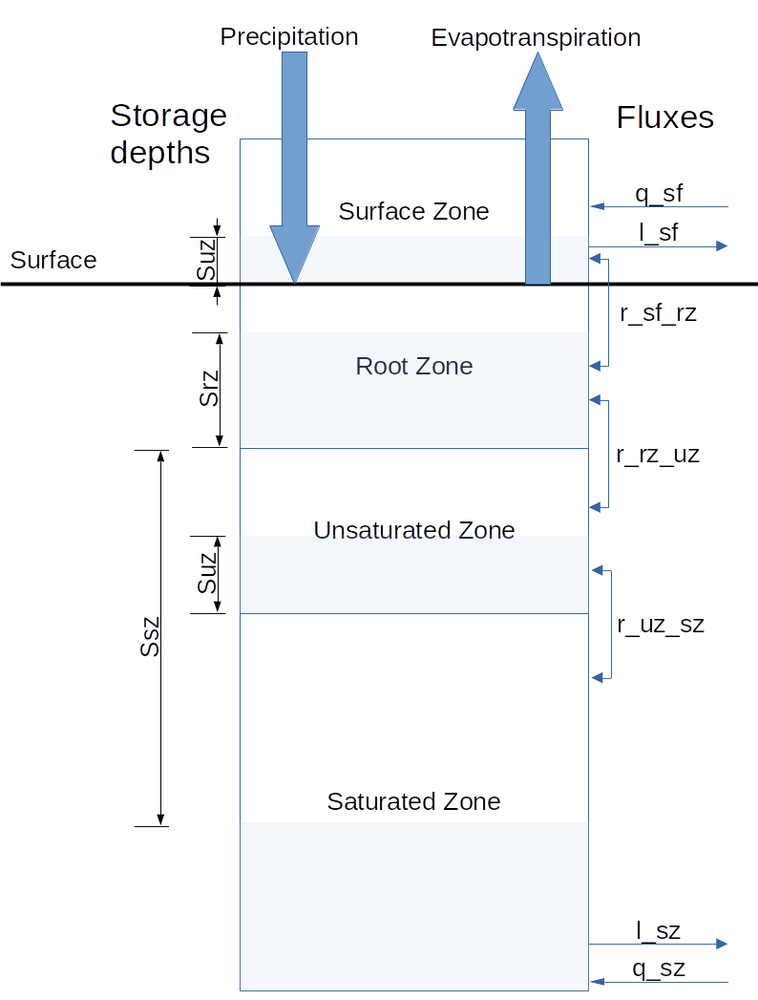

# Conceptual model

One of the underlying principles of dynamic TOPMODEL is that the landscape can
be broken up into hydrologically similar regions, or Hydrological Response
Units (HRUs), where all the area within a HRU behaves in a hydrologically
similar fashion. Further discussion and the connection of HRUs is outlined [elsewhere](Notes_on_the_implementation_of_Dynamic_TOPMODEL.html).

This document outlines the conceptual structure and computational
implementation of the HRU. The HRU is a representation of 
an area of teh catchment with, for example, similar topographic, soil and upslope area
characteristics.

The HRU is considered to be a area of catchment with outflow
occurring across a specified width of it boundary.
It is formed of four zones representing the surface water, which
passes water between HRUs and drains to the root zone. The root zone characterises
the interactions between evapotranspiration and precipitation and when full spills to
the unsaturated zone. This drains to the saturated zone which also interacts
with other HRUs. The behaviour of the saturated zone is modelled using a kinematic wave
approximation. The zones and variables used below are shown in the schematic diagram.

```{r, echo=FALSE, purl=FALSE, out.width="75%", fig.align="center", fig.cap="Schematic of the Hill slope HRU"}

```

In the following section the governing equations of the HRU are
given in a finite volume form. Approximating equations for the solution of the
governing equations are then derived with associated implicit and semi-implicit numerical
schemes. These are valid for the wide range of surface zone and saturated zone
transmissivity profiles presented in the vignette.

Two appendices provide supporting information justifying the numerical schemes
and an alternative derivation of the governing equations based on the
infinitesimal vertical slab used in the original derivation of Dynamic TOPMODEL.

# Notation

Table \@ref(tab:hs-x-notation) outlines the notation used for describing an
infinitesimal slab across the hillslope HRU. 

The following conventions are used:

-   All properties such as slope angles and time constants are considered
    uniform along the hillslope.
	
-   Precipitation and Potential Evapotranspiration occur at spatially uniform
    rates.
	
-   All vertical fluxes $r_{\star \rightarrow \star}$ are considered to
	spatially uniform and to be positive when
	travelling in the direction of the arrow, but can, in some cases be negative.

-   All lateral fluxes $q_{\star}$ and $q_{\star}$ are considered to be positive flows travelling downslope.

-   The superscripts $^+$ and $^-$ are used to denote variables for the outflow
    and inflow to the hillslope.

-   $\left.y\right\rvert_t$ indicates the value of the
    variable $y$ at time $t$

-   In the derivation storage values at a given cross section of the HRU are
expressed as a depth  and denoted with a $\bar{}$. So integrating
over the length of the hillslope we find

\begin{equation}
\int w \bar{y} dx = y
\end{equation}
	
| Quantity type              | Symbol                  | Description                                                              | unit    |
|----------------------------|-------------------------|--------------------------------------------------------------------------|---------|
| Storage                    | $s_{sf}$                | Surface excess storage                                                   | m$^3$   |
|                            | $s_{rz}$                | Root zone storage                                                        | m$^3$   |
|                            | $s_{uz}$                | Unsaturated zone storage                                                 | m$^3$   |
|                            | $s_{sz}$                | Saturated zone storage deficit                                           | m$^3$   |
| Vertical fluxes            | $r_{sf \rightarrow rz}$ | Flow from the surface excess store to the root zone                      | m$^3$/s |
|                            | $r_{rz \rightarrow uz}$ | Flow from the root zone to the unsaturated zone                          | m$^3$/s |
|                            | $r_{uz \rightarrow sz}$ | Flow from unsaturated to saturated zone                                  | m$^3$/s |
| Lateral fluxes             | $q_{sf}$                | Lateral flow in the hillslope surface zone                               | m$^3$/s |
|                            | $q_{sz}$                | Lateral inflow to the hillslope surface zone                             | m$^3$/s |
| Vertical fluxes to the HRU | $p$                     | Precipitation rate                                                       | m/s     |
|                            | $e_p$                   | Potential Evapotranspiration rate                                        | m/s     |
| Other HRU properties       | $A$                     | Plan area                                                                | m$^3$   |
|                            | $w$                     | Width of a hill slope cross section                                      | m       |
|                            | $\Delta x$              | Effective length of the hillslope HRU (\Delta x = A/w$)                  | m       |
|                            | $\Theta_{sf}$           | Further properties and parameters for the solution of the surface zone   | :-:     |
|                            | $\Theta_{rz}$           | Further properties and parameters for the solution of the root zone      | :-:     |
|                            | $\Theta_{uz}$           | Further properties and parameters for the solution of the saturated zone | :-:     |
|                            | $\Theta_{sz}$           | Further properties and parameters for the solution of the saturated zone | :-:     |
                                                    
  Table: (\#tab:hs-x-notation) Outline of notation for describing a cross
  section of the hillslope HRU

# Finite Volume Formulation

In this section a finite volume formulation of the Dynamic TOPMODEL equations
is derived. 

## Surface zone

The storage in the surface zone satisfies $s_{sf} \geq 0$.
Surface storage is increased by lateral downslope flow from upslope HRUs. 
Water flows to the root zone at a constant rate $r_{sf \rightarrow rz}$, unless limited by
the available storage at the surface or the ability of the root zone to
receive water (for example if the saturation storage deficit is 0 and the root zone storage is full).

In cases where lateral flows in the saturated zone produce
saturation storage deficits water may be returned from the root
zone to the surface giving negative values of $r_{sf \rightarrow rz}$.


The governing ODE for a cross section of the hillslope can be written as a
variable parameter muskingham model (see Appendix A)


\begin{equation}
\frac{dw\bar{s}_{sf}}{dt} = - \frac{dq_{sf}}{dx} - w r_{sf \rightarrow rz}
\end{equation}
where $r_{sf \rightarrow rz} \leq k_{sf}$.

Integration over the hillslope length and substituting in the spatial averages gives
\begin{equation}
A\frac{d \bar{s}_{sf}}{dt} = q_{sf}^{-} - q_{sf}^{+} - A\bar{r}_{sf \rightarrow rz}
\end{equation}

The outflow comes from two sources; the runoff-attenuation feature
(RAF) and surface flow; giving

\[
q_{sf}^{+} = w^{+}l_{sf}^{+} + \frac{A}{t_{raf}}\min\left(s_{raf},\bar{s}_{sf}\right)
\]

Since $\Delta x = A/w^{+}$ and $l_{sf}^{-} = q_{sf}^{-}/w^{+}$ re arranging gives
\begin{equation}
\frac{d \bar{s}_{sf}}{dt} = \frac{1}{\Delta x}\left(l_{sf}^{-} -
l_{sf}^{+}\right) - \frac{1}{t_{raf}}
\min\left(s_{raf},\bar{s}_{sf}\right) - \bar{r}_{sf \rightarrow rz}
\end{equation}

This equation represents the evolution in time of $\bar{s}_{sf}$ expressed in
terms of the unit width fluxes, the runoff attenuation feature outflow and an effective length $A/w^+$

To complete the formulation assume that 
$l_{sf}^{+} = c_{sf}\max\left(0,\bar{s}_{sf} - s_{raf}\right)$.
which gives
\begin{equation}
\frac{d \bar{s}_{sf}}{dt} = \frac{1}{\Delta x}\left(l_{sf}^{-} -
c_{sf}\max\left(0,\bar{s}_{sf}-s_{raf}\right)\right) 
- \frac{1}{t_{raf}} \min\left(s_{raf},\bar{s}_{sf}\right)
- \bar{r}_{sf \rightarrow rz}
\end{equation}


## Root zone

The root zone gains water from precipitation and the surface zone. It loses water through
evaporation and to the unsaturated zone. Since
all the vertical fluxes are spatially uniform the evolution can be evaluated
in terms of the spatial averages. The root zone storage satisfies

\begin{equation} 0 \leq \bar{s}_{rz} \leq s_{rzmax} \end{equation}

with the governing ODE
\begin{equation}
\frac{d\bar{s}_{rz}}{dt} = p - \frac{e_p}{s_{rzmax}} \bar{s}_{rz} +
\bar{r}_{sf\rightarrow rz} - \bar{r}_{rz \rightarrow uz}
\end{equation}

Fluxes from the surface and to the unsaturated zone are
controlled by the level of root zone storage along with the state of the unsaturated
and saturated zones.

For $\bar{s}_{rz} \leq s_{rzmax}$ then $\bar{r}_{rz \rightarrow uz} \leq 0$. Negative
values of $\bar{r}_{rz \rightarrow uz}$ may occur only when water is returned from the
unsaturated zone due to saturation caused by lateral inflow to the saturated zone.

When $\bar{s}_{rz} = s_{rzmax}$ then 
\begin{equation}
p - e_p + \bar{r}_{sf\rightarrow rz} - \bar{r}_{rz \rightarrow uz} \leq 0
\end{equation}
In this case $\bar{r}_{rz \rightarrow uz}$ may be positive if
\begin{equation}
p - e_p + \bar{r}_{sf\rightarrow rz} > 0
\end{equation}
so long as the unsaturated zone can receive the water. If $\bar{r}_{rz
\rightarrow uz}$ is 'throttled' by the rate at which the unsaturated zone can
receive water, then $\bar{r}_{sf\rightarrow rz}$ is adjusted (potentially becoming
negative) to ensure the equality is met.


## Unsaturated Zone

The unsaturated zone acts as a non-linear tank subject to the constraint 
\begin{equation} 0 \leq \bar{s}_{uz} \leq \bar{s}_{sz} \end{equation}

The governing ODE is written as
\begin{equation}
\frac{d\bar{s}_{uz}}{dt} = \bar{r}_{rz \rightarrow uz} - \bar{r}_{uz \rightarrow sz}
\end{equation}

If water is able to pass freely to the saturated zone, then it flows at the rate
$\frac{\bar{s}_{uz}}{T_d \bar{s}_{sz}}$. If $\bar{s}_{sz}=\bar{s}_{uz}=0$ this is interpreted to mean
that the flow rate is $\frac{1}{T_d}$. 
In this situation where $\bar{s}_{sz}=\bar{s}_{uz}$ the subsurface below
the root zone can be considered saturated, as in there is no further available
storage for water, but separated into parts: an upper part with vertical
flow and a lower part with lateral flux.

It is possible that $\bar{r}_{uz \rightarrow sz}$ is
constrained by the ability of the saturated zone to receive water. If
this is the case $\bar{r}_{uz \rightarrow sz}$ occurs at the maximum
possible rate and $\bar{r}_{rz \rightarrow uz}$ is limited to ensure that
$\bar{s}_{uz} \leq \bar{s}_{sz}$.

## Saturated Zone

For a HRU the alteration of the storage in the saturated zone is
given by the kinematic equation
\begin{equation}
\frac{dw\left(D-s_{sz}\right)}{dt} = -\frac{dq_{sz}}{dx} + w r_{uz \rightarrow sz}
\end{equation}

Integration over the length of the hillslope and substitution of the
spatial averaged values gives
\begin{equation}
-A\frac{d\bar{s}_{sz}}{dt} = q_{sz}^{-} - q_{sz}^{+}  + A\bar{r}_{uz \rightarrow sz}
\end{equation}

Rearranging this gives
\begin{equation}
\frac{d\bar{s}_{sz}}{dt} = \frac{1}{\Delta x}\left(l_{sz}^{+} - l_{sz}^{-}\right) - \bar{r}_{uz \rightarrow sz}
\end{equation}

The Kinematic approximation then depends upon the specification of a relationship
 between $\bar{s}_{sz}$ and $l_{sz}^{+}$. This usually termed the transmissivity
 profile however the use of the average, rather than cross sectional saturated
 storage deficit means this term is used only loosely. More generally the
 relationship is taken
to be a one-to-one, continuously differentiable function 
$g: \mathcal{R^{+}}\rightarrow \mathcal{R}^{+}$ which returns the lateral flow on
a unit width such that $l_{sz}^{+} = g\left(\bar{s}_{sz},\Theta_{sz}\right)
 \geq 0$ which satisfies
\begin{equation}
-\frac{dl_{sz}^{+}}{d\bar{s}_{sz}} = -\frac{d}{d\bar{s}_{sz}}g\left(\bar{s}_{sz},\Theta_{sz}\right) \geq 0
\end{equation}
and
\begin{equation}
g\left(\bar{s}_{sz},\Theta_{sz}\right) \rightarrow 0 \quad \mathrm{as} \quad
 \bar{s}_{sz}\rightarrow \infty
\end{equation}
The first condition ensures a non negative celerity (wave speed) which is in
keeping with the conceptualisation of the model. The first condition also implies
that $l_{sz}^{+}$ decreases with increasing $\bar{s}_{sz}$. This combined with
 the second condition ensures that the model represents a state where no
 lateral inflow is generated.

Using the relationship between $l_{sz}^{+}$ and $\bar{s}_{sz}$ gives
\begin{equation}
\frac{d\bar{s}_{sz}}{dt} = \frac{1}{\Delta x}\left(g\left(\bar{s}_{sz},\Theta_{sz}\right) - l_{sz}^{-}\right) - \bar{r}_{uz \rightarrow sz}
\end{equation}

# Approximating Equations

No analytical solution yet exists for simultaneous integration of the system of
ODEs outlined above. In the following an implicit scheme, where fluxes
between stores are considered constant over the time step and gradients are
evaluated at the final state, is presented.

The basis of the solution is that a gravity driven system will maximise
the downward flow of water within each timestep of size $\Delta t$. 


Recalling that the temporal and spatial average vertical fluxes are denoted with
a $\hat{}$ the implicit approximations are stated in the following sections using the unknown vertical fluxes
$\hat{r}_{\star \rightarrow \star}$ which are then determined by maximising the
downward flux.

## Surface excess

The implicit scheme gives

\begin{equation}
\left. \bar{s}_{sf}  \right\rvert_{\Delta t}
=
\left. \bar{s}_{sf} \right\rvert_{0}
+ \frac{\Delta t}{\Delta x} \left(
\hat{l}_{sf}^{-} - c_{sf} \max\left(0, \left. \bar{s}_{sf}
\right\rvert_{\Delta t} - s_{raf}\right)
\right) 
- \frac{\Delta t}{t_{raf}} \min\left(s_{raf},\left. \bar{s}_{sf}
\right\rvert_{\Delta t}\right)
- \Delta t \hat{r}_{sf \rightarrow rz}
\end{equation}

To ensure that the surface storage does not become negative
\begin{equation}
\hat{r}_{sf \rightarrow rz} \leq \min\left( k_{sf},
\left. \frac{1}{\Delta t}\left(\bar{s}_{sf} \right\rvert_{0} + \frac{\Delta
t}{\Delta x} \hat{l}_{sf}^{-}
\right)\right)
\end{equation}

The surface outflow over the time step is evaluated as
\begin{equation}
\hat{q}_{sf}^{+} = w^{+}c_{sf} \max\left(0, \left. \bar{s}_{sf}
\right\rvert_{\Delta t} -s_{raf}\right) + 
\frac{A}{t_{raf}} \min\left(s_{raf},\left. \bar{s}_{sf}
\right\rvert_{\Delta t}\right)
\end{equation}

The solution for $\left. \bar{s}_{sf}
\right\rvert_{\Delta t}$ is conditional upon which side of $s_{raf}$
it falls.
If 
\[
s_{raf} \lt 
\left. \bar{s}_{sf} \right\rvert_{0}
+ \frac{\Delta t}{\Delta x} \hat{l}_{sf}^{-}
- \frac{\Delta t}{t_{raf}} s_{raf}
  - \Delta t \hat{r}_{sf \rightarrow rz}
\]

then $\left. \bar{s}_{sf}
\right\rvert_{\Delta t} \gt s_{raf}$ and is given by
\begin{equation}
\left. \bar{s}_{sf}  \right\rvert_{\Delta t}
= \left(1 + \frac{c_{sf}\Delta t}{\Delta x}\right)^{-1}
\left( \left. \bar{s}_{sf} \right\rvert_{0}
+  \frac{\Delta t}{\Delta x} \hat{l}_{sf}^{-}
+ \frac{c_{sf}\Delta t}{\Delta x} s_{raf}
- \frac{\Delta t}{t_{raf}} s_{raf}
- \Delta t \hat{r}_{sf \rightarrow rz}
\right)
\end{equation}

Otherwise 
\begin{equation}
\left. \bar{s}_{sf}  \right\rvert_{\Delta t}
= \left(1 + \frac{\Delta t}{t_{raf}}\right)^{-1}
\left( \left. \bar{s}_{sf} \right\rvert_{0}
+  \frac{\Delta t}{\Delta x} \hat{l}_{sf}^{-}
- \Delta t \hat{r}_{sf \rightarrow rz}
\right)
\end{equation}

To ensure that the surface storage does not become negative
\begin{equation}
\hat{r}_{sf \rightarrow rz} \leq \min\left( k_{sf},
\left. \frac{1}{\Delta t}\left(\bar{s}_{sf} \right\rvert_{0} + \frac{\Delta
t}{\Delta x} \hat{l}_{sf}^{-}
\right)\right)
\end{equation}


The surface outflow over the time step is evaluated as
\begin{equation}
\hat{q}_{sf}^{+} = w^{+}c_{sf} \left. \bar{s}_{sf}  \right\rvert_{\Delta t}
\end{equation}

## Root Zone

The implicit formulation for the root zone gives
\begin{equation}
\left. \bar{s}_{rz} \right.\rvert_{\Delta t} = 
\left( 1 + \frac{e_{p}\Delta t}{s_{rzmax}} \right)^{-1}
\left(
\left. \bar{s}_{rz} \right.\rvert_{0}
+ \Delta t \left(
p + \hat{r}_{sf \rightarrow rz} - \hat{r}_{rz \rightarrow uz} \right)
\right)
\end{equation}

Since flow to the unsaturated zone occur only to keep 
$\bar{s}_{rz} \leq s_{rzmax}$ then
\begin{equation}
\hat{r}_{rz \rightarrow uz} \leq \max\left(0,
\frac{1}{\Delta t}\left(
\left. \bar{s}_{rz} \right.\rvert_{0}
+ \Delta t \left(
p + \hat{r}_{sf \rightarrow rz} - e_{p} \right)
- s_{rzmax}
\right)\right)
\end{equation}

## Unsaturated Zone

The expression for the unsaturated zone is given in terms of
$\left. \bar{s}_{uz} \right.\rvert_{\Delta t}$ and 
$\left. \bar{s}_{sz} \right.\rvert_{\Delta t}$ as

\begin{equation}
\left. \bar{s}_{uz} \right.\rvert_{\Delta t} = 
\frac{T_{d}\left. \bar{s}_{sz} \right.\rvert_{\Delta t}}{
T_{d}\left. \bar{s}_{sz} \right.\rvert_{\Delta t} + \Delta t}
\left( \left. \bar{s}_{uz} \right.\rvert_{0} + \Delta t \hat{r}_{rz
\rightarrow uz}\right)
\end{equation}

Since $\left. \bar{s}_{uz} \right.\rvert_{\Delta t} \leq \left. \bar{s}_{sz}
	   \right.\rvert_{\Delta t}$ this places an additional condition of
\begin{equation}
\hat{r}_{rz \rightarrow uz} \leq \frac{1}{\Delta t} \left(
\left. \bar{s}_{sz} \right.\rvert_{\Delta t} + \frac{\Delta t}{T_d} - \left. \bar{s}_{uz} \right.\rvert_{0}\right)
\end{equation}

This condition also implies that $\hat{r}_{uz \rightarrow sz} \leq
								  \frac{1}{T_d}$

## Saturated Zone

Initial evaluation and substitution of the flux from the unsaturated zone gives
\begin{equation}
\left. \bar{s}_{sz}\right.\rvert_{\Delta t} = 
\left. \bar{s}_{sz}\right.\rvert_{\Delta 0} + 
\frac{\Delta t}{\Delta x} \left(g\left(\left.\bar{s}_{sz}\right\rvert_{\Delta t},\Theta_{sz}\right) -
l_{sz}^{-}\right) - \Delta t \frac{
\left. \bar{s}_{uz} \right.\rvert_{0} + \Delta t \hat{r}_{rz \rightarrow uz} }
{ T_{d}\left. \bar{s}_{sz} \right.\rvert_{\Delta t} + \Delta t}
\end{equation}

Limiting the inflow by reaching the saturation level gives

\begin{equation}
\hat{r}_{rz \rightarrow uz} \leq \frac{1}{\Delta t}\left(
\left. \bar{s}_{sz}\right.\rvert_{\Delta 0} + 
\frac{\Delta t}{\Delta x} \left(g\left(\left.\bar{s}_{sz}\right\rvert_{\Delta t},\Theta_{sz}\right) -
l_{sz}^{-}\right) - \left. \bar{s}_{uz} \right.\rvert_{0} \right)
\end{equation}

Selecting $\bar{s}_{sz}$ and $\hat{r}_{rz \rightarrow uz}$ to satisfy the above equation describes a non-linear
problem with two unknowns a multiple solutions. A further condition, that the
downward flux is maximised, is imposed to ensure a unique solution.

# Numerical Algorithm

An implementation of the approximating equations which is consistent with
maximising the downward flux produces a fully implicit numeric scheme.

The maximum downward flux from the surface is given by 
\[
\check{r}_{sf \rightarrow rz} = \min\left( k_{sf},
\left. \frac{1}{\Delta t}\left(\bar{s}_{sf} \right\rvert_{0} + \frac{\Delta
t}{\Delta x} \hat{l}_{sf}^{-}
\right)\right)
\]

which results in a maximum downward flux from the root zone of 
\[
\check{r}_{rz \rightarrow uz} = \max\left(0, \frac{1}{\Delta t}\left(
\left. \bar{s}_{rz} \right.\rvert_{0} + \Delta t \left( p + \check{r}_{sf
\rightarrow rz} - e_{p} \right) - s_{rzmax} \right)\right)
\]


Consider the pseudo-function 
\[
f\left(z\right) = 
z - 
\left. \bar{s}_{sz}\right.\rvert_{0} -
\frac{\Delta t}{\Delta x} \left(g\left(z,\Theta_{sz}\right) -
l_{sz}^{-}\right) + \Delta t \min\left(\frac{1}{T_d},\frac{
\left. \bar{s}_{uz} \right.\rvert_{0} + \Delta t \check{r}_{rz \rightarrow uz} }
{ T_{d} z + \Delta t}\right)
\]

adapted from the approximating equation for the saturated zone storage with the minima
ensuring the limit on the flux from the unsaturated zone. If $f(0) \geq 0$ the
downward flux is enough to produce saturation in the subsurface and
$\left. \bar{s}_{sz}\right.\rvert_{\Delta t} = 0$. If  $f(0) < 0$ then
$\left. \bar{s}_{sz}\right.\rvert_{\Delta t}$ is given by a solution of
$f(z) = 0$. In Appendix A it is
shown that $f\left(z\right)$ is a monotonic increasing function of
$z > 0$; hence if $f\left(0\right) \leq 0$ and $f\left(D\right) \geq 0$ a
unique solution for $\left. \bar{s}_{sz}\right.\rvert_{\Delta t}$ can be found.

<!-- ### Algorithm 1 - Simple Implicit -->

A direct implementation of the above results takes the form of Algorithm 1.

***
*Algorithm 1: Direct Implementation*

1. Compute $\check{r}_{sf \rightarrow rz}$ and $\check{r}_{rz \rightarrow uz}$
2. Test for saturation. If $f\left(0\right) \geq
   0$ then go to Step 3 else go to Step 4
3. Saturated. Set $\left. \bar{s}_{sz}\right.\rvert_{\Delta t} = 0$ and
\[\hat{r}_{rz \rightarrow uz} = \frac{1}{\Delta t}\left(
\left. \bar{s}_{sz}\right.\rvert_{\Delta 0} + 
\frac{\Delta t}{\Delta x} \left(g\left(0,\Theta_{sz}\right) -
l_{sz}^{-}\right) - \left. \bar{s}_{uz} \right.\rvert_{0} \right)
\]
Go to Step 5.
4. Not saturated. Find $\left. \bar{s}_{sz}\right.\rvert_{\Delta t}$ such that 
$f\left(\left. \bar{s}_{sz}\right.\rvert_{\Delta t}\right) = 0$ and take 
\[
\hat{r}_{rz \rightarrow uz} = \min\left(\check{r}_{rz \rightarrow uz},\frac{1}{\Delta t} \left(
\left. \bar{s}_{sz} \right.\rvert_{\Delta t} + \frac{\Delta t}{T_d} -
 \left. \bar{s}_{uz} \right.\rvert_{0}\right)\right)\]
 Go to Step 5.
5. Compute 
\[
\hat{r}_{sf \rightarrow rz} = \min\left(\check{r}_{sf \rightarrow
  rz}, \frac{1}{\Delta t}\left( s_{rzmax} - 
\left. \bar{s}_{rz} \right.\rvert_{0} - \Delta t \left( p - e_p - \hat{r}_{rz
  \rightarrow uz} \right) \right)\right)\] 
6. Solve for $\left. \bar{s}_{uz}\right.\rvert_{\Delta t}$,
$\left. \bar{s}_{rz}\right.\rvert_{\Delta t}$ and
$\left. \bar{s}_{sf}\right.\rvert_{\Delta t}$ using the computed vertical
fluxes.

***

The challenge with Algorithm 1 is that maintaining a water (mass) balance and
correct limits on the state values
depends upon the accuracy of the solution of $f\left(z\right)=0$. Since
finding $z$ requires multiple evaluations of the transmissivity profile it can
rapidly become the most expensive part of the code. 

To limit the computational cost suppose that $f\left(z\right)=0$ is solved
approximately to give $\tilde{z}$
such that for some numerical tolerance $\epsilon$ we have $\left\lvert
f\left(\tilde{z}\right) \right\rvert \leq \epsilon$. Using $\tilde{z}$ to
evaluate the outward lateral flux from the saturated zone gives the
pseudo-function
\[
h\left(z\right) = 
z - 
\left. \bar{s}_{sz}\right.\rvert_{0} -
\frac{\Delta t}{\Delta x} \left(g\left(\tilde{z},\Theta_{sz}\right) -
l_{sz}^{-}\right) + \Delta t \min\left(\frac{1}{T_d},\frac{
\left. \bar{s}_{uz} \right.\rvert_{0} + \Delta t \check{r}_{rz \rightarrow uz} }
{ T_{d} z + \Delta t}\right)
\]

Since $h\left(z\right)$ is a monotonic increasing function of
$z > 0$ the solution for $\left. \bar{s}_{sz}\right.\rvert_{\Delta t}$ is
similar to that using $f\left(z\right)$. Taking $z \in \left[0,D\right]$ the
solution for $\left. \bar{s}_{sz}\right.\rvert_{\Delta t}$ is given by

- If $h(0) \geq 0$ the inward flux is enough to produce saturation in the subsurface and
$\left. \bar{s}_{sz}\right.\rvert_{\Delta t} = 0$.
- If $h(z_{max}) < 0$ (possible only due to the outflow flux approximation) then
$\left. \bar{s}_{sz}\right.\rvert_{\Delta t} = D$ and the lateral outflow is
adjusted such that
\[
\frac{\Delta t}{\Delta x} l_{sz}^{+} = 
D - 
\left. \bar{s}_{sz}\right.\rvert_{0} +
\frac{\Delta t}{\Delta x} l_{sz}^{-} + 
\Delta t \min\left(\frac{1}{T_d},\frac{
\left. \bar{s}_{uz} \right.\rvert_{0} + \Delta t \check{r}_{rz \rightarrow uz} }
{ T_{d} D + \Delta t}\right)
\]
- If $h(0) < 0$ and If $h(D) \geq 0$ then with $z_{C} =  \left. \bar{s}_{uz} \right.\rvert_{0} + \Delta t\left(
  \check{r}_{rz \rightarrow uz} - \frac{1}{T_{d}}\right)$
  - If $h\left( z_{C} \right) \geq 0$ then the inflow from the unsaturated
  zone is $1/T_{d}$ and 
  \[
  \left. \bar{s}_{sz}\right.\rvert_{\Delta t} =
  \left. \bar{s}_{sz}\right.\rvert_{0} +
\frac{\Delta t}{\Delta x} \left(g\left(\tilde{z},\Theta_{sz}\right) -
l_{sz}^{-}\right) - \frac{\Delta t}{T_d}
  \]
  - else (see Appendix C)
  \[
z = \frac{1}{2}\left(-b + \sqrt{ b^2 - 4c }\right) \\
= \frac{1}{2} \left( z_{C} - h\left(z_{C}\right) + \sqrt{
\left(h\left(z_{C}\right)-z_{C}\right)^2 - 4 \frac{\Delta t}{T_{d}}
h\left(z_{C}\right) } \right)
\]

The implementation of this approach is presented in Algorithm 2. it can be seem
that the exchange for decreasing the accuracy of the solution of the zero
finding problem is a potential to evaluate a power and a square root.

***
*Algorithm 2: Stable Implementation*

1. Compute $\check{r}_{sf \rightarrow rz}$ and $\check{r}_{rz \rightarrow uz}$
2. Compute the lateral outflow
   - If $f\left(0\right) \geq 0$ then $l_{sz}^{+} = l_{szmax}$
   - else find $\tilde{z}$ such that $\left\lvert
f\left(\tilde{z}\right) \right\rvert \leq \epsilon$. Set $l_{sz}^{+} = g\left(\tilde{z},\Theta\right)$
3. Solve for $\left. \bar{s}_{sz}\right.\rvert_{\Delta t}$
   - If $h(0) \geq 0$ then
   $\left. \bar{s}_{sz}\right.\rvert_{\Delta t} = 0$.
   - If $h(z_{max}) < 0$ then $\left. \bar{s}_{sz}\right.\rvert_{\Delta t} = D$ and
\[
\frac{\Delta t}{\Delta x} l_{sz}^{+} = 
D - 
\left. \bar{s}_{sz}\right.\rvert_{0} +
\frac{\Delta t}{\Delta x} l_{sz}^{-} + 
\Delta t \min\left(\frac{1}{T_d},\frac{
\left. \bar{s}_{uz} \right.\rvert_{0} + \Delta t \check{r}_{rz \rightarrow uz} }
{ T_{d} D + \Delta t}\right)
\]
   - else with $z_{C} =  \left. \bar{s}_{uz} \right.\rvert_{0} + \Delta t\left(
  \check{r}_{rz \rightarrow uz} - \frac{1}{T_{d}}\right)$
     - If $h\left( z_{C} \right) \geq 0$ then 
  \[
  \left. \bar{s}_{sz}\right.\rvert_{\Delta t} =
  \left. \bar{s}_{sz}\right.\rvert_{0} +
\frac{\Delta t}{\Delta x} \left(g\left(\tilde{z},\Theta_{sz}\right) -
l_{sz}^{-}\right) - \frac{\Delta t}{T_d}
  \]
     - else
  \[
\left. \bar{s}_{sz}\right.\rvert_{\Delta t} =
= \frac{1}{2} \left( z_{C} - h\left(z_{C}\right) + \sqrt{
\left(h\left(z_{C}\right)-z_{C}\right)^2 - 4 \frac{\Delta t}{T_{d}}
h\left(z_{C}\right) } \right)
\]
4. Solve for $\hat{r}_{rz \rightarrow uz}$
   - If $\left. \bar{s}_{sz}\right.\rvert_{\Delta t} = 0$ then
\[\hat{r}_{rz \rightarrow uz} = \frac{1}{\Delta t}\left(
\left. \bar{s}_{sz}\right.\rvert_{\Delta 0} + 
\frac{\Delta t}{\Delta x} \left(g\left(0,\Theta_{sz}\right) -
l_{sz}^{-}\right) - \left. \bar{s}_{uz} \right.\rvert_{0} \right)
\]
   - else 
\[
\hat{r}_{rz \rightarrow uz} = \min\left(\check{r}_{rz \rightarrow uz},\frac{1}{\Delta t} \left(
\left. \bar{s}_{sz} \right.\rvert_{\Delta t} + \frac{\Delta t}{T_d} -
 \left. \bar{s}_{uz} \right.\rvert_{0}\right)\right)\]
5. Compute 
\[
\hat{r}_{sf \rightarrow rz} = \min\left(\check{r}_{sf \rightarrow
  rz}, \frac{1}{\Delta t}\left( s_{rzmax} - 
\left. \bar{s}_{rz} \right.\rvert_{0} - \Delta t \left( p - e_p - \hat{r}_{rz
  \rightarrow uz} \right) \right)\right)\] 
6. Solve for $\left. \bar{s}_{uz}\right.\rvert_{\Delta t}$,
$\left. \bar{s}_{rz}\right.\rvert_{\Delta t}$ and
$\left. \bar{s}_{sf}\right.\rvert_{\Delta t}$ using the computed vertical
fluxes.

***


# Transmissivity Profiles

The solution and numerical scheme have been presented with a general
transmissivity function $g\left(\bar{s}_{sz},\Theta_{sz}\right)$. Table
\@ref(tab:hs-transmissivity) present the transmissivity profiles present as options within the `dynatop`
package, the corresponding value to use for the `transmissivity_profile` value
in the model options vector and the additional parameters or properties
required. The additional parameter and properties are defined in Table \@ref(tab:hs-transmissivity-param).

| Name                | $g\left(\bar{s}_{sz},\Theta_{sz}\right)$                                                                                       | Celerity                                                      | $\Theta_{sz}$     |  `transmissivity_profile` value    | Notes                                                        |
| ----                | ----                                                                                                                           | ----                                                        | ----              | ----            | ----                                                         |
| Exponential          | $T_{0}\sin\left(\beta\right)\exp\left(-\frac{\cos\beta}{m}s_{sz}\right)$                                                       | $\frac{\cos\beta}{m}g\left(\bar{s}_{sz},\Theta_{sz}\right)$ | $T_0,\beta,m$ | `"exp"` | Originally given in [Beven & Freer 2001](https://doi.org/10.1002/hyp.252) |
| Bounded Exponential | $T_{0}\sin\left(\beta\right)\left(\exp\left(-\frac{\cos\beta}{m}s_{sz}\right) - \exp\left(-\frac{\cos\beta}{m}D\right)\right)$ | $\frac{cos \beta}{m}T_{0}\sin\left(\beta\right)\exp\left(-\frac{\cos\beta}{m}s_{sz}\right)$ | $T_0,\beta,m,D$ | `"bexp"` | Originally given in [Beven & Freer 2001](https://doi.org/10.1002/hyp.252) |
| Constant Celerity  | $c_{sz}\left(D-s_{sz}\right)$ | $c_{sz}$ | $c_{sz},D$ | `"cnst"` |   |   |
| Double Exponential | $T_{0}\sin\left(\beta\right)\left( \omega\exp\left(-\frac{\cos\beta}{m}s_{sz}\right) + \left(1-\omega\right)\exp\left(\frac{\cos\beta}{m_2}s_{sz}\right)\right)$                               | $\omega\frac{cos \beta}{m}T_{0}\sin\left(\beta\right)\exp\left(-\frac{\cos\beta}{m}s_{sz}\right) + \left(1-\omega \right)\frac{cos \beta}{m_2}T_{0}\sin\left(\beta\right)\exp\left(-\frac{\cos\beta}{m_2}s_{sz}\right)$ | $T_0,\beta,m,m_2,\omega$    | "dexp"             |   |
                                                    
  Table: (\#tab:hs-transmissivity) Transmissivity profiles available with the
  `dynatop` package.


| Symbol   | Description                             | unit     |
|----------|-----------------------------------------|----------|
| $T_0$    | Transmissivity at saturation             | m$^2$/s  |
| $m$,$m_2$ | Exponential transmissivity constants    | m$^{-1}$ |
| $\beta$  | Angle of hill slope                     | rad      |
| $c_{sz}$ | Saturated zone celerity                 | m/s      |
| $D$      | Depth at which zero lateral flow occurs | m        |
| $\omega$ | weighting parameter                     | -        |


  Table: (\#tab:hs-transmissivity-param) Additional parameters used in the transmissivity profiles.

# Appendix A - Variable Parameter Muskingham

Muskingham routing can be derived in a numer of ways. Consistent with the
wedge derivation the evolution of the storage $s$ in a reach of length $\Delta
x$ can be expressed in terms of the inflow $q^{-}$,
outflow $q^{+}$ and lateral inflow per unit area $r$ along with the two
parameters $\eta$ and $\kappa$ as

\[
\frac{ds}{dt} = q^{-} + Ar - q^{+} \\
s = \kappa\left(\eta q^{-} + \left(1-\eta\right) q^{+} \right)
\]

subsitution gives the ODE
\[
\frac{ds}{dt} = \frac{1}{1-\eta} q^{-} + Ar -
\frac{1}{\kappa\left(1-\eta\right)} s 
\]

Assuming $\eta$ and $\kappa$ are constant over the time window $\delta t$ this
gives the solution

\[
\left. s \right.\rvert_{t + \delta t} = 


\]
By derivation this scheme is mass conservative. To maintain positive flows and
storage requires $\kappa >0$ and $1 \geq \eta \geq 0$. Further requirements
upon $\kappa$ and $\eta$ result from maintaining a positive value of
$o_{t}$. Sufficent, but not nessecary, conditions are that
\[
\frac{\Delta t}{2} \geq \kappa_{t}\eta_{t}
\]
and 
\[
\kappa_{t-1} \left(1-\eta_{t-1}\right) \geq \frac{\Delta t}{2} \\
\kappa_{t-1} - \frac{\Delta t}{2} \geq \kappa_{t-1}\eta_{t-1}
\]


## Approximating Tank Models

A tank model with possibly varying time constant $T$ takes $o =
\frac{1}{T}s$. This is a special case of the Muskingham solution with $\eta=0$
and $\kappa = T$.

Subsitution into the solution gives

\[
\left( 1 + \frac{\Delta t}{2T_{t}} \right) s_{t} = 
s_{t-1}
+ \frac{\Delta t}{2} \left(i_{t} + i_{t-1}\right) +
\left( 1 - \frac{\Delta t}{2T_{t-1}} \right) s_{t-1}
+ l_{t} \Delta x \Delta t
\]


## Approximating Diffusion Wave Routing

Diffuse routing with lateral inflow can be expressed as the parabolic
equation \footnote{doi:10.1016/j.advwatres.2005.08.008}

\[
\frac{dq}{dt} + c\frac{dq}{dx} - D \frac{d^2 q}{dx^2} = cl - D \frac{dl}{dx}
\]

where $l$ is lateral inflow per unit reach length. Simplify this by
considering, as in the muskingham derivation, a constant lateral inflow along the reach so that $\frac{dl}{dx}=0$ to give

\[
\frac{dq}{dt} + c\frac{dq}{dx} - D \frac{d^2 q}{dx^2} = cl
\]

Let us relate this to the Muskingham Solution using the relationship
\[
q = \eta i + \left(1-\eta\right)o
\]

By the wedge approximation with reach length $\Delta x$ the flux $q$ occurs at
$\eta \Delta x$

Taking Taylor series expansions for $i$ and $o$ based on $q$ gives

\[
o \approx q + \left(1-\eta\right)\Delta x \frac{dq}{dx} + \frac{1}{2}\left(1-\eta\right)^2\Delta x^2 \frac{d^2 q}{dx^2}
\]
and
\[
i \approx q - \eta \Delta x \frac{dq}{dx} + \frac{1}{2}\eta^2 \Delta x^2 \frac{d^2 q}{dx^2}
\]

Subtracting the expression for $i$ from that for $o$ gives

\[
o - i \approx
\left(1-\eta\right)\Delta x \frac{dq}{dx} + \eta \Delta x \frac{dq}{dx} +
\frac{1}{2}\left(1-\eta\right)^2\Delta x^2 \frac{d^2 q}{dx^2} -
\frac{1}{2}\eta^2 \Delta x^2 \frac{d^2 q}{dx^2} \\
\approx \Delta x \frac{dq}{dx} + \frac{1}{2}\left(1-2\eta\right)\Delta x^2 \frac{d^2 q}{dx^2}
\]

From the mass balance condition of the Muskingham routing
\[
o - i = - \frac{ds}{dt} + \Delta x l
\]

Subsituting this and rearranging gives

\[
\frac{dq}{dx} \approx
- \frac{1}{\Delta x} \frac{ds}{dt} + l -
\frac{1}{2}\left(1-2\eta\right)\Delta x \frac{d^2 q}{dx^2}
\]

Since $q = \frac{s}{\kappa}$ the chain rule gives

\[
\frac{dq}{dt} = \frac{1}{\kappa}\frac{ds}{dt} - \frac{s}{\kappa^2}\frac{d\kappa}{dt}
\]

Allowing for $\kappa$ to be an unknown function of $s$ results in
\[
\frac{dq}{dt} = \frac{1}{\kappa}\frac{ds}{dt}
\left(1 - \frac{s}{\kappa^2}\frac{d\kappa}{ds}\right)
\]
 
Subsituting these into the orginal diffuse routing equation gives

\[
\frac{1}{\kappa}\left(1 - \frac{s}{\kappa^2}\frac{d\kappa}{ds}\right)\frac{ds}{dt} - 
\frac{c}{\Delta x} \frac{ds}{dt} +
cl -
\frac{1}{2}\left(1-2\eta\right)c\Delta x \frac{d^2 q}{dx^2}
- D \frac{d^2 q}{dx^2} \approx cl
\]

The terms involving the lateral inflow cancel. Equating the terms to remove
$\frac{d^2 q}{dx^2}$ and $\frac{d s}{dt}$ give

\[
\frac{c\Delta x}{2}\left(2\eta -1\right) = D 
\]

and

\[
\frac{1}{\kappa}\left(1 - \frac{s}{\kappa^2}\frac{d\kappa}{ds}\right) = \frac{c}{\Delta x}
\]

respectively. 

<!-- The value of $\kappa$ is valid for any $c>0$.  -->

The value of $\eta$ is limited. Firstly $\eta = 1/2$ gives no dispersion; that
is the Kinematic wave equation. Taking  $\eta=1$ produces the maxium
dispersion of $D = \frac{c\Delta x}{2}$. This imposes a relationship between reach length,
dispersion and celerity that can represented.

## Constant Celerity and Diffusivity

If $c$ and $D$ are constant it is imediatly apparent that 

\[
\eta = \left( \frac{2D}{c\Delta x} + 1\right) \frac{1}{2}
\]

Rearrangment of the equation for $\kappa$ gives

\[
\frac{d\kappa}{ds}
= \frac{\kappa^2}{s}\left( 1 - \frac{c \kappa}{\Delta x}\right)
\]

From this the constant parameter Muskingham method given in <TODO ref>
can be retreived by nooting that $\frac{d\kappa}{ds} = 0$ hence
$\kappa = \frac{\Delta x}{c}$

While this solution is known to be unconditionally stable and seconf
order accurate <TODO ref> it can display osscilatory behaviour. <TODO
ref> show how by limiting the enforcing a relationship between $\Delta
t$ and $\Delta x$ this can be avoided.

Cosidering the physical interpretaion of $\kappa$ in terms of the
water velocity $v$ as
\[
\kappa = \frac{\Delta x}{v}
\]
it is clear that the constant parameter Muskingham formulation
cofounds the wave speed $c$ with the water velocity $v$, in effect
producing a constant celerity forumation by imposing a constant
velocity.

relationship between


# Appendix A - Monotonicity of $f\left(z\right)$

By definition $\left. \bar{s}_{uz} \right.\rvert_{0}$, $\Delta t$, $\Delta X$,
$T_d$, $\check{r}_{rz
\rightarrow uz}$ and $z$ are all greater or equal to 0. Rewrite the expression for $f\left(z\right)$ as
\[
f\left(z\right) = \left\{ \begin{array}{cl}
z - 
\left. \bar{s}_{sz}\right.\rvert_{\Delta 0} -
\frac{\Delta t}{\Delta x} \left(g\left(z,\Theta_{sz}\right) -
l_{sz}^{-}\right) + \frac{\Delta t}{T_d} & 
\frac{
\left. \bar{s}_{uz} \right.\rvert_{0} + \Delta t \check{r}_{rz \rightarrow uz} }
{ T_{d} z + \Delta t} \geq \frac{1}{T_d} \\
z - 
\left. \bar{s}_{sz}\right.\rvert_{\Delta 0} -
\frac{\Delta t}{\Delta x} \left(g\left(z,\Theta_{sz}\right) -
l_{sz}^{-}\right) + \Delta t \frac{
\left. \bar{s}_{uz} \right.\rvert_{0} + \Delta t \check{r}_{rz \rightarrow uz} }
{ T_{d} z + \Delta t} & 
\frac{
\left. \bar{s}_{uz} \right.\rvert_{0} + \Delta t \check{r}_{rz \rightarrow uz} }
{ T_{d} z + \Delta t} < \frac{1}{T_d}
\end{array}\right.
\]

Differentiating with respect to $z$ gives
\[
\frac{d}{dz} f\left(z\right) = \left\{ \begin{array}{cl}
1 - 
\frac{\Delta t}{\Delta x} \frac{d}{dz}g\left(z,\Theta_{sz}\right) & 
\frac{
\left. \bar{s}_{uz} \right.\rvert_{0} + \Delta t \check{r}_{rz \rightarrow uz} }
{ T_{d} z + \Delta t} \geq \frac{1}{T_d} \\
1 - 
\frac{\Delta t}{\Delta x} \frac{d}{dz}g\left(z,\Theta_{sz}\right)
- T_d \Delta t \frac{
\left. \bar{s}_{uz} \right.\rvert_{0} + \Delta t \check{r}_{rz \rightarrow uz} }
{ \left(T_{d} z + \Delta t\right)^2} & 
\frac{
\left. \bar{s}_{uz} \right.\rvert_{0} + \Delta t \check{r}_{rz \rightarrow uz} }
{ T_{d} z + \Delta t} < \frac{1}{T_d}
\end{array}\right.
\]

The definition of the function $g$ states that 
\[
-\frac{d}{dz}g\left(z,\Theta_{sz}\right) \geq 0
\]
Using this relationship and the expression for the range of $z$ gives
\[
\frac{d}{dz} f\left(z\right) \geq \left\{ \begin{array}{cl}
1 & 
\frac{
\left. \bar{s}_{uz} \right.\rvert_{0} + \Delta t \check{r}_{rz \rightarrow uz} }
{ T_{d} z + \Delta t} \geq \frac{1}{T_d} \\
1 - \frac{\Delta t}{T_{d} z + \Delta t} & 
\frac{
\left. \bar{s}_{uz} \right.\rvert_{0} + \Delta t \check{r}_{rz \rightarrow uz} }
{ T_{d} z + \Delta t} < \frac{1}{T_d}
\end{array}\right.
\]

From this it can be seen that $\frac{d}{dz} f\left(z\right) \geq 0$ with
equality possible when $z=0$.

# Appendix B - Comparison to the Infinitesimal slab derivation

## Surface Zone

A similar expression for the evolution can be derived by considering the
infinitesimal slab at the downslope end of the HRU. Taking a discrete
approximation for the change of flow with length the governing ODE can be written as
\begin{equation}
\frac{dw^{+}s_{sf}^{+}}{dt} = \frac{q_{sf}^{-} - q_{sf}^{+}}{\Delta x} - w^{+}r_{sf \rightarrow rz}^{+}
\end{equation}

Dividing through by $w^{+}$ gives
\begin{equation}
\frac{ds_{sf}^{+}}{dt} = \frac{q_{sf}^{-}/w^{+} - l_{sf}^{+}}{\Delta x} - r_{sf \rightarrow rz}^{+}
\end{equation}

Note the similarities between this and the finite volume solution. In fact if
$r_{sf \rightarrow rz}$ is taken to be spatially uniform and 
$\Delta x = A/w^{+}$ then this solution for $s_{sf}^{+}$ will evolve in a similar fashion to
$\bar{s}_{sf}$

## Root Zone

The same formulation follows for the infinitesimal slab at the bottom of the
hillslope with the averaged terms (using $\bar{}$) replaced with those valid
at the bottom of the hillslope (using $^{+}$).

## Unsaturated Zone

The same formulation follows for the infinitesimal slab at the bottom of the
hillslope with the averaged terms (using $\bar{}$) replaced with those valid
at the bottom of the hillslope (using $^{+}$).

## Saturated Zone

Evaluating for the foot of the hillslope and taking a discrete approximation
of the spatial gradient gives
\begin{equation}
\frac{ds_{sz}^{+}}{dt} = \frac{l_{sz}^{+} - q_{sz}^{-}/w^{+}}{\Delta x} - r_{uz \rightarrow sz}^{+}
\end{equation}

As with the surface zone we see the similarity in form, indicating that,
subject to the evaluation of the temporal integral, the two formulations
should return the same results when $\Delta x = A/w^{+}$

# Appendix C Solution to $h\left(z\right)$ when $h(0) < 0$ and $h(D) \geq 0$

In this case we see that $0 < z < D$. Taking $z_{C} =  \left. \bar{s}_{uz} \right.\rvert_{0} + \Delta t\left(
  \check{r}_{rz \rightarrow uz} - \frac{1}{T_{d}}\right)$ the function $h$ can
  be rewritten as
\[
h\left(z\right) = \left\{ \begin{array}{cl}
z -
\left. \bar{s}_{sz}\right.\rvert_{\Delta 0} -
\frac{\Delta t}{\Delta x} \left(l_{sz}^{+} -
l_{sz}^{-}\right) + \frac{\Delta t}{T_d}
& z_{C} \geq z \\
z -
\left. \bar{s}_{sz}\right.\rvert_{0} -
\frac{\Delta t}{\Delta x} \left(l_{sz}^{+} -
l_{sz}^{-}\right) + \Delta t \frac{
\left. \bar{s}_{uz} \right.\rvert_{0} + \Delta t \check{r}_{rz \rightarrow uz} }
{ T_{d} z + \Delta t}
& z_{C} < z
\end{array} \right.
\]

Using the monotonicity of $h\left(z\right)$ we solve each part
separately. Firstly if $h\left( z_{C} \right) \geq 0$ then the inflow from the unsaturated
  zone is $1/T_{d}$ and 
  \[
  \left. \bar{s}_{sz}\right.\rvert_{\Delta t} =
  \left. \bar{s}_{sz}\right.\rvert_{0} +
\frac{\Delta t}{\Delta x} \left(g\left(\tilde{z},\Theta_{sz}\right) -
l_{sz}^{-}\right) - \frac{\Delta t}{T_d}
  \]
  
if $h\left( z_{C} \right) < 0$ the value of $z$ satisfies
\[
z -
\left. \bar{s}_{sz}\right.\rvert_{0} -
\frac{\Delta t}{\Delta x} \left(l_{sz}^{+} -
l_{sz}^{-}\right) + \Delta t \frac{
\left. \bar{s}_{uz} \right.\rvert_{0} + \Delta t \check{r}_{rz \rightarrow uz} }
{ T_{d} z + \Delta t} =
0
\]
Rearrangement to a quadratic gives
\[
0 = T_{d} z^2 - T_{d} z \left(\left. \bar{s}_{sz}\right.\rvert_{0} +
	\frac{\Delta t}{\Delta x} \left(l_{sz}^{+} -
		l_{sz}^{-}\right) \right) +
	\Delta t z -
	\Delta t \left(\left. \bar{s}_{sz}\right.\rvert_{0} +
		\frac{\Delta t}{\Delta x} \left(l_{sz}^{+} -
		l_{sz}^{-}\right) \right)
		 +
\Delta t \left(
\left. \bar{s}_{uz} \right.\rvert_{0} + \Delta t \check{r}_{rz \rightarrow uz}
\right)
\]
\[
0 = z^2 - z \left(\left. \bar{s}_{sz}\right.\rvert_{0} +
	\frac{\Delta t}{\Delta x} \left(l_{sz}^{+} -
		l_{sz}^{-}\right)  - \frac{\Delta t}{T_{d}}\right) +
		\frac{\Delta t}{T_{d}} \left(
		\left. \bar{s}_{uz} \right.\rvert_{0} + \Delta t \check{r}_{rz
		\rightarrow uz} -
		\left. \bar{s}_{sz}\right.\rvert_{0} - 
		\frac{\Delta t}{\Delta x} \left(l_{sz}^{+} -
		l_{sz}^{-}\right) \right)
\]

The commonly quoted solution for the quadratic
\[
0 = z^2 + b z +c
\]
is 
\[
z = \frac{-b \pm\sqrt{ b^2 - 4c }}{2}
\]
Comparing terms we see that 
\[
-b = \left. \bar{s}_{sz}\right.\rvert_{0} +
	\frac{\Delta t}{\Delta x} \left(l_{sz}^{+} -
		l_{sz}^{-}\right)  - \frac{\Delta t}{T_{d}}
\]

and
\[
c = 
		\frac{\Delta t}{T_{d}} \left(
		\left. \bar{s}_{uz} \right.\rvert_{0} + \Delta t \check{r}_{rz
		\rightarrow uz} -
		\left. \bar{s}_{sz}\right.\rvert_{0} - 
		\frac{\Delta t}{\Delta x} \left(l_{sz}^{+} -
		l_{sz}^{-}\right) \right)
\]

Since $-b = z_{C} - h\left(z_{C}\right)$ gives $-b > 0$.
Since $z > z_{C}$ the subsurface ($s_{uz}$ and
$s_{sz}$) does not fill so
\[
\left. \bar{s}_{sz}\right.\rvert_{0} - \left. \bar{s}_{uz}
\right.\rvert_{0} \gt
\Delta t \check{r}_{rz \rightarrow uz} -
\frac{\Delta t}{\Delta x} \left(l_{sz}^{+} -
		l_{sz}^{-}\right)
\]
and $c < 0$

Combining these conditions results in 
$\sqrt{b^2 - 4c} > \left\lvert b \right\rvert$. Since $z>0$ only one root of
the quadratic is valid (as always positive) so
\[
z = \frac{1}{2}\left(-b + \sqrt{ b^2 - 4c }\right)
\]

