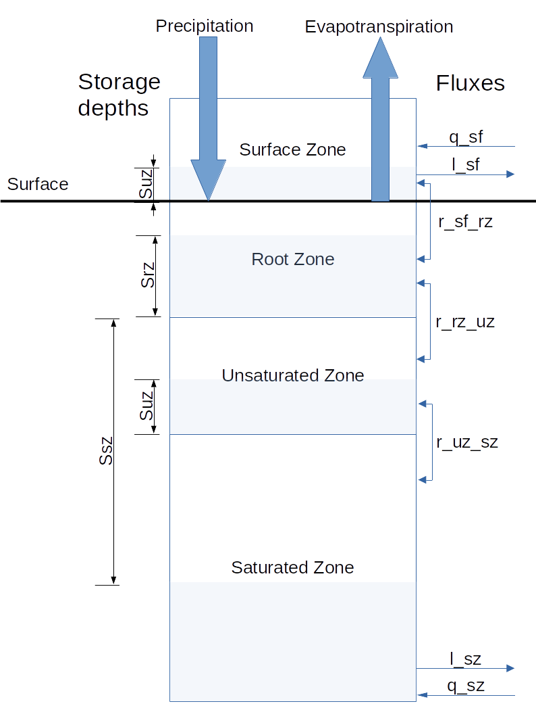

# Conceptual model

One of the underlying principles of dynamic TOPMODEL is that the landscape can
be broken up into hydrologically similar regions, or Hydrological Response
Units (HRUs), where all the area within a HRU behaves in a hydrologically
similar fashion. Further discussion and the connection of HRUs is outlined [elsewhere](Notes_on_the_implementation_of_Dynamic_TOPMODEL.html).

This document outlines the conceptual structure and computational
implementation of the HRU. The HRU is a representation of 
an area of the catchment with, for example, similar topographic, soil and upslope area
characteristics.

We conceptualise the model using cells, that is area where flux is
vertical, and edges over which lateral fluxes pass.

The cell is formed of four zones representing the surface water, which
passes over edges between cells and drains to the root zone. The root zone characterises
the interactions between evapotranspiration and precipitation and when full spills to
the unsaturated zone. This drains to the saturated zone which also has
edges to other cells. The zones and variables used below are shown in the schematic diagram.

```{r, echo=FALSE, purl=FALSE, out.width="75%", fig.align="center", fig.cap="Schematic of the Hill slope HRU"}

```

In the following sections the governing equations of the cell are
given in a finite volume form and the equations for transport over the
edges are derived. Approximating equations for the solution of the
governing equations are then derived with associated implicit and semi-implicit numerical
schemes. These are valid for the wide range of surface zone and saturated zone
transmissivity profiles presented in the vignette. Appendices provide supporting information.

# Notation

Table \@ref(tab:hs-x-notation) outlines the notation used for describing an
infinitesimal slab across the hillslope HRU. 

The following conventions are used:

-   All properties such as slope angles and time constants are considered
    uniform along the hillslope.
	
-   Precipitation and Potential Evapotranspiration occur at spatially uniform
    rates.
	
-   All vertical fluxes $r_{\star \rightarrow \star}$ are considered to
	spatially uniform and to be positive when
	travelling in the direction of the arrow, but can, in some cases be negative.

-   All lateral fluxes $q_{\star}$ and $q_{\star}$ are considered to be positive flows travelling downslope.

-   The superscripts $^+$ and $^-$ are used to denote variables for the outflow
    and inflow to the hillslope.

-   $\left.y\right\rvert_t$ indicates the value of the
    variable $y$ at time $t$

<!-- -   In the derivation storage values at a given cross section of the HRU are -->
<!-- expressed as a depth  and denoted with a $\bar{}$. So integrating -->
<!-- over the length of the hillslope we find -->

<!-- \begin{equation} -->
<!-- \int w \bar{y} dx = y -->
<!-- \end{equation} -->
	
| Quantity type              | Symbol                  | Description                                                              | unit    |
|----------------------------|-------------------------|--------------------------------------------------------------------------|---------|
| Storage                    | $s_{sf}$                | Surface excess storage                                                   | m$^3$   |
|                            | $s_{rz}$                | Root zone storage                                                        | m$^3$   |
|                            | $s_{uz}$                | Unsaturated zone storage                                                 | m$^3$   |
|                            | $s_{sz}$                | Saturated zone storage deficit                                           | m$^3$   |
| Vertical fluxes            | $r_{sf \rightarrow rz}$ | Flow from the surface excess store to the root zone                      | m$^3$/s |
|                            | $r_{rz \rightarrow uz}$ | Flow from the root zone to the unsaturated zone                          | m$^3$/s |
|                            | $r_{uz \rightarrow sz}$ | Flow from unsaturated to saturated zone                                  | m$^3$/s |
| Lateral fluxes             | $q_{sf}$                | Lateral flow in the hillslope surface zone                               | m$^3$/s |
|                            | $q_{sz}$                | Lateral inflow to the hillslope surface zone                             | m$^3$/s |
| Vertical fluxes to the HRU | $p$                     | Precipitation rate                                                       | m$^3$/s     |
|                            | $e_p$                   | Potential Evapotranspiration rate                                        | m$^3$/s     |
| Other HRU properties       | $A$                     | Plan area                                                                | m$^2$   |
|                            | $w$                     | Width of a hill slope cross section                                      | m       |
|                            | $\Delta x$              | Effective length of the hillslope HRU (\Delta x = A/w$)                  | m       |
|                            | $\Theta_{sf}$           | Further properties and parameters for the solution of the surface zone   | :-:     |
|                            | $\Theta_{rz}$           | Further properties and parameters for the solution of the root zone      | :-:     |
|                            | $\Theta_{uz}$           | Further properties and parameters for the solution of the saturated zone | :-:     |
|                            | $\Theta_{sz}$           | Further properties and parameters for the solution of the saturated zone | :-:     |
                                                    
  Table: (\#tab:hs-x-notation) Outline of notation for describing a cross
  section of the hillslope HRU

# Finite Volume Formulation for a cell

In this section a finite volume formulation of the Dynamic TOPMODEL equations
is derived for the evolution of the states over the time step $t$ to $t +
\Delta t$. The lateral flux rates are considered to occur over the cell
edges and are considered as constant over the time step. 
The vertical flux rates are considered as constant throughout the
time step, allowing for a semi-analytical solution of some storage zones.

## Surface zone

Take flux over the surface edge to be positive when leaving the cell.
The storage in the surface zone satisfies the mass balance equation

\[
\frac{ds_{sf}}{dt} = q_{sf}^{-} - q_{sf}^{+} - r_{sf \rightarrow rz}
\]

Water flows to the root zone at a constant rate $r_{sf \rightarrow rz}$, unless limited by
the available storage at the surface or the ability of the root zone to
receive water (for example if the saturation storage deficit is 0 and the root
zone storage is full). In cases where lateral flow in the saturated zone produce
saturation storage deficits water may be returned from the root
zone to the surface giving negative values of $r_{sf \rightarrow rz}$.

Surface outflows to neighbouring cells are controlled by the surface
gradient. Letting $\mathcal{N}$ be the neighbouring downslope cells
the total outflow is given by

\[
q_{sf}^{+} = Q_{sf}\left(s_{sf}\right) \\
= \sum\limits_{i \in \mathcal{N}} 
\left( 
a_{1,i}\min\left(s_{sf},s_{1}\right)^{b_{1}} 
+ 
a_{2,i}\max\left(0,\min\left(s_{sf}-s_{1},s_{2}-s_{1}\right)\right)^{b_{2}} + 
a_{3,i}\max\left(0,s_{sf}-s_{2}\right)^{b_{3}} 
\right)
\]
This three layer structure can be made to match a variety of dynamics
as outlined in **TODO**

## Root zone

The root zone gains water from precipitation and the surface zone. It loses water through
evaporation and to the unsaturated zone. All vertical fluxes are
considered to be spatially uniform.  The root zone storage satisfies

\begin{equation} 0 \leq s_{rz} \leq s_{rzmax} \end{equation}

with the governing ODE
\begin{equation}
\frac{ds_{rz}}{dt} = p - \frac{e_p}{s_{rzmax}} s_{rz} +
r_{sf\rightarrow rz} - r_{rz \rightarrow uz}
\end{equation}

Fluxes from the surface and to the unsaturated zone are
controlled by the level of root zone storage along with the state of the unsaturated
and saturated zones.

For $s_{rz} \leq s_{rzmax}$ then $r_{rz \rightarrow uz} \leq 0$. Negative
values of $r_{rz \rightarrow uz}$ may occur only when water is returned from the
unsaturated zone due to saturation caused by lateral inflow to the saturated zone.

When $s_{rz} = s_{rzmax}$ then 
\begin{equation}
p - e_p + r_{sf\rightarrow rz} - r_{rz \rightarrow uz} \leq 0
\end{equation}
In this case $r_{rz \rightarrow uz}$ may be positive if
\begin{equation}
p - e_p + r_{sf\rightarrow rz} > 0
\end{equation}
so long as the unsaturated zone can receive the water. If $r_{rz
\rightarrow uz}$ is 'throttled' by the rate at which the unsaturated zone can
receive water, then $r_{sf\rightarrow rz}$ is adjusted (potentially becoming
negative) to ensure the equality is met.


## Unsaturated & Saturated Zone

The unsaturated and saturated zones act in a coupled fashion subject
to the constraint 
\begin{equation} 0 \leq s_{uz} \leq s_{sz} \end{equation}

The continuity equations can be expressed as
\[
\frac{ds_{uz}}{dt} = r_{rz \rightarrow uz} -  r_{uz \rightarrow sz}
\]
\[
\frac{ds_{sz}}{dt} = q_{sz}^{+} -
r_{uz \rightarrow uz} - q_{sz}^{-}
\]

The outflow from the saturated zone is given by
\[
q_{sz}^{+} =  T\left(s_{sz}\right) \sum\limits_{i \in \mathcal{N}} w_{i} \tan\left(\beta_{i}\right)
\]

In many TOPMODEL and dynamic TOPMODEL forumations the flux between the
unsaturated ans saturated zones is given by
\[
r_{uz \rightarrow sz} = \frac{A s_{uz}}{T_d s_{sz}}
\]
While it is acknowledged that this formaulation has no physical
basis (Beven, The Primer, Box?? 20**) it has generally been
interpreted as indicating that the unsaturated zone drains as a linear
tank with time constant $\frac{T_d s_{sz}}{A}.

Here we develop an equally parsimonious alternative informed by the
previsou analysis of (Beven 1984, Ion, 1989 paper, URBS model paper).
Let $K_0$ be the saturated conductivity of the surface layer. On
the basis that saturated conductivity decreases with depth let, for
for some storage defict $z$
\[
K\left(z\right) = K_0 \exp\left(-\frac{z}{m}\right)
\]

Assuming there is no preferential flow pathway the downslope transmissivity for
a storage deficit $s_{sz}$ is given by
\[
T\left(s_{sz}\right) =  \int\limits_{s_{sz}}^{\infty} K\left(z\right) dz \\
= K_0 \int\limits_{s_{sz}}^{\infty} \exp\left(-\frac{z}{m}\right) dz \\
= K_0 \left[-m \exp\left(-\frac{z}{m}\right) \right]_{s_{sz}}^{\infty} \\
= m K_0 \exp\left(-\frac{s_{sz}}{m}\right)
\]


For vertical flow it is assumed that the flow interfaces saturate from
above so the inflow to the unsaturated zone is
$\min\left(r_{rz \rightarrow uz},AK_{0}\right)$. However if the
unsaturated zone is not full (i.e. not $s_{uz} = s_{sz}$) then the
interface to the saturated zone may not be saturated from above. To
approximate this the flux is taken to be

\[
r_{uz \rightarrow sz} = A K_0 \exp\left(-\frac{s_{sz}}{m}\right) \frac{s_{uz}}{s_{sz}}
\]

The ratio $\frac{s_{uz}}{s_{sz}}$ approximates the gradient of the
vertical hydraulic head.

The continuity equations can be rewritten as
\[
\frac{ds_{uz}}{dt} = \min\left(r_{rz \rightarrow uz},AK_{0}\right)
- A K_0 \exp\left(-\frac{s_{sz}}{m}\right) \frac{s_{uz}}{s_{sz}}
\]
\[
\frac{ds_{sz}}{dt} = 
\sum\limits_{i \in \mathcal{N}} w_{i}\tan\left(\beta_{i}\right) m K_0
\exp\left(-\frac{s_{sz}}{m}\right)
- A K_0 \exp\left(-\frac{s_{sz}}{m}\right) \frac{s_{uz}}{s_{sz}}
- q_{sz}^{-}
\]
or with $W_{\beta} = \sum\limits_{i \in \mathcal{N}}
w_{i}\tan\left(\beta_{i}\right)$

\[
\frac{ds_{sz}}{dt} = 
\left( W_{\beta} m - A\frac{s_{uz}}{s_{sz}} \right) K_0 \exp\left(-\frac{s_{sz}}{m}\right)
- q_{sz}^{-}
\]


# Numerical Solution

No analytical solution yet exists for simultaneous integration of the system of
ODEs outlined above. In the following an implicit scheme, where fluxes
between stores are considered constant over the time step and gradients are
evaluated at the final state, is presented.

The basis of the solution is that a gravity driven system will maximise
the downward flow of water within each timestep of size $\Delta t$. Hence on
the first downward pass through the stores the maximum downward volumes of the vertical
fluxes $\hat{v}_{* \rightarrow *} = \Delta t \hat{r}_{* \rightarrow *}$ are determined. These then moderated by the
solution of the saturated zone, with an upward pass giving the final states.

## Downward Pass

### Surface excess

The implicit solution of mass balance equation gives

\[
\left. s_{sf} \right\rvert_{t+\Delta t} = \left. s_{sf} \right\rvert_{t} +
\Delta t 
\left( \left. q_{sf}^{-} \right\rvert_{t+\Delta t} -
Q_{sf}\left( \left. s_{sf}\right\rvert_{t+\Delta t} \right) \right) - 
\left. v_{sf \rightarrow rz} \right\rvert_{t+\Delta t}
\]

Since downward flux is prioritised the maximum downward flux volume is
\[
\left. \hat{v}_{sf \rightarrow rz} \right\rvert_{t+\Delta t} =  \left. s_{sf}
\right\rvert_{t} + \Delta t \left. q_{sf}^{-} \right\rvert_{t+\Delta t}
\]

### Root Zone

The implicit formulation for the root zone gives
\begin{equation}
\left. s_{rz} \right.\rvert_{t + \Delta t} = 
\left( 1 + \frac{e_{p}\Delta t}{s_{rzmax}} \right)^{-1}
\left(
\left. s_{rz} \right.\rvert_{0}
+ \Delta t p + 
v_{sf \rightarrow rz} - v_{rz \rightarrow uz} \right)
\end{equation}

Since flow to the unsaturated zone occur only to keep 
$s_{rz} \leq s_{rzmax}$ and at a maximum rate $AK_{0}$ then
\begin{equation}
\hat{v}_{rz \rightarrow uz} = \min\left(A K_{0} \Delta t,
\max\left(0,
\left. s_{rz} \right.\rvert_{t}
+ \Delta t \left( p -e_{p}\right)
+ \hat{v}_{sf \rightarrow rz}
- s_{rzmax}
\right)\right)
\end{equation}

### Unsaturated & Saturated Zones

The unsaturated ans saturated zones are solved semi-implicitly by
taking an implicit estimate the transmissivity of the interface
between the unsaturated and saturated zones:

\[
\phi = AK_{0}\exp\left(-\frac{\left. s_{sz} \right.\rvert_{t}}{m}\right)
\]

Continuity for the unsaturated zone then gives
\[
\left. s_{uz} \right.\rvert_{t + \Delta t} = \min\left( 
\left. s_{sz} \right.\rvert_{t + \Delta t},
\left. s_{uz} \right.\rvert_{t} + \hat{v}_{rz \rightarrow uz} -
\Delta t \phi \frac{ \left. s_{uz} \right.\rvert_{t + \Delta t} } {
\left. s_{sz} \right.\rvert_{t + \Delta t} }
\right)
\]

and for the saturated zone

\[
\left. s_{sz} \right.\rvert_{t + \Delta t} = \max\left( 
0,
\left. s_{sz} \right.\rvert_{t} + 
\Delta t W_{\beta}mK_{0}\exp\left(-\frac{\left. s_{sz}
\right.\rvert_{t+\Delta t}}{m}\right) - 
\Delta t \phi \frac{ \left. s_{uz} \right.\rvert_{t + \Delta t} } {
\left. s_{sz} \right.\rvert_{t + \Delta t} } -
\left. q_{sz}^{-} \right\rvert_{t+\Delta t} \Delta t 
\right)
\]

In deriving a numeric scheme for thse coupled equations we observed
that
\[
\frac{
\left. s_{uz} \right.\rvert_{t + \Delta t}
}{
\left. s_{sz} \right.\rvert_{t + \Delta t}
} = \left\{
\begin{array}{cc}
\frac{ \left. s_{uz} \right.\rvert_{t} + \hat{v}_{rz \rightarrow uz} }
{ \left. s_{sz} \right.\rvert_{t + \Delta t} + \phi \Delta t} & 
\left. s_{sz} \right.\rvert_{t + \Delta t} \geq \left. s_{uz}
\right.\rvert_{t} + \hat{v}_{rz \rightarrow uz} - \phi \Delta t \\
1 & \rm{otherwise} \\
\end{array}
\right.
\]

Consider the pseudo-function 
\[
\mathcal{H}\left(z\right) = \left\{
\begin{array}{cc}
\left. s_{sz} \right.\rvert_{t} + 
\Delta t W_{\beta}mK_{0}\exp\left(-\frac{z}{m}\right) - 
\Delta t \phi \frac{ \left. s_{uz} \right.\rvert_{t} + \hat{v}_{rz \rightarrow uz} }
{z + \phi \Delta t} -
\left. q_{sz}^{-} \right\rvert_{t+\Delta t} \Delta t - z & z \geq \left. s_{uz}
\right.\rvert_{t} + \hat{v}_{rz \rightarrow uz} - \phi \Delta t \\
\left. s_{sz} \right.\rvert_{t} + 
\Delta t W_{\beta}mK_{0}\exp\left(-\frac{z}{m}\right) - 
\Delta t \phi  -
\left. q_{sz}^{-} \right\rvert_{t+\Delta t} \Delta t - z &
\rm{otherwise}\\
\end{array}
\right.
\]

adapted from the approximating equation for continuity in the
saturated zone storage. Differentiating with respect to $z$ gives

\[
\frac{\partial}{\partial z}\mathcal{H}\left(z\right) = \left\{
\begin{array}{cc}
- \frac{\Delta t W_{\beta}mK_{0}}{m}\exp\left(-\frac{z}{m}\right) + 
\frac{\Delta t \phi}{z + \phi \Delta t} 
\frac{ \left. s_{uz} \right.\rvert_{t} + \hat{v}_{rz \rightarrow uz} }
{z + \phi \Delta t} - 1
 & z \geq \left. s_{uz}
\right.\rvert_{t} + \hat{v}_{rz \rightarrow uz} - \phi \Delta t \\
-\frac{\Delta t W_{\beta}mK_{0}}{m}\exp\left(-\frac{z}{m}\right) - 
1 &
\rm{otherwise}\\
\end{array}
\right.
\]
from which in can be seen that $\mathcal{H}\left(z\right)$ is a monotonic decreasing function of
$z > 0$ and $\mathcal{H}\left(z\right) \rightarrow -\infty$ as $z
\rightarrow \infty$.

Hence if $\mathcal{H}\left(0\right) \gt 0$ a unique solution
$\mathcal{H}\left(z\right) = 0$ can be found to provide a value for
$\left. s_{sz}\right.\rvert_{\Delta t}$. 
If  $\mathcal{H}\left(0\right) \leq 0$ then the incoming fluxes are enough to
produce saturation in the subsurface and
$\left. s_{sz}\right.\rvert_{\Delta t} = 0$. 

Maintaining a water (mass) balance and
correct limits on the state values
depends upon the accuracy of the solution of
$\mathcal{H}\left(z\right)=0$. 
The use of a
numerical scheme which allows mass balance to maintained
regardless of the accuracy of the solution of $\mathcal{H}\left(z\right)=0$
allows scope for compromises based on computational time.

The upward pass presented below is mass conservative so long as
$\mathcal{H}\left(\left. s_{sz}\right.\rvert_{\Delta t}\right)\leq 0$. 
We therefore seek $z$ which satifies for some tolerance $\epsilon>0$
\[
-\epsilon \leq \mathcal{H}\left(z\right) \leq 0
\]
One approach to finding such a value is use a bracketing algorithm. At each iteration the lower and upper limits  $z^{l} <
z^{u}$ satisify $\mathcal{H}\left(z^{l}\right)\geq 0 \geq
\mathcal{H}\left(z^{u}\right)$, thus bracket the solution. Iterating (using for example bisection) until
 $\mathcal{H}\left(z^{u}\right) \geq -\epsilon$ and give the approximation $\left. s_{sz}\right.\rvert_{\Delta t} = z^{u}$.


**GOT HERE**

## Upward Pass

Given an estimate of $\left. s_{sz}\right.\rvert_{\Delta t}$ such that
$\mathcal{H}\left(\left. s_{sz}\right.\rvert_{t+\Delta t}\right) \leq 0$ compute the
vertical flux volumes in the following fashion

1. Compute $v_{uz \rightarrow sz} = \Delta t \phi \min\left(1,\frac{ \left. s_{uz} \right.\rvert_{t} + \hat{v}_{rz \rightarrow uz} }
{\left. s_{sz}\right.\rvert_{t + \Delta t}z + \phi \Delta t} \right)$

1. $\left. q_{sz}^{+}\right.\rvert_{t+\Delta t} = \frac{1}{\Delta t}
   \left( \left. s_{sz}\right.\rvert_{t+\Delta t} -
   \left. s_{sz}\right.\rvert_{t} + v_{uz \rightarrow sz} +
   \left. q_{sz}^{-} \right\rvert_{t+\Delta t} \Delta t \right)$

1. $\left. s_{uz}\right.\rvert_{t+\Delta t} =
   \min\left(\left. s_{sz}\right.\rvert_{t+\Delta
   t},\left. s_{uz}\right.\rvert_{t} + \hat{v}_{rz \rightarrow uz} - v_{uz
   \rightarrow sz}\right)$
   
1. $v_{rz \rightarrow uz} = \left. s_{uz}\right.\rvert_{t+\Delta t}
   -\left. s_{uz}\right.\rvert_{t} + v_{uz \rightarrow sz}$
   
1. $v_{sf \rightarrow rz} = \min\left(\hat{v}_{sf \rightarrow rz}, s_{rzmax} - 
   \left. \bar{s}_{rz} \right.\rvert_{0} - \Delta t \left( p - e_p \right)  + {v}_{rz
   \rightarrow uz} \right)$
  
1. Solve for $\left. s_{rz}\right.\rvert_{t+\Delta t}$ using the equation
   already given.
   
1. Compute the volume loss to evapotranspiration as
   $\left. v_{e_{p}}\right.\rvert_{t+\Delta t} =
   \left. s_{rz}\right.\rvert_{t} + v_{sf \rightarrow rz} - v_{rz \rightarrow
   uz} + \Delta t p - \left. s_{rz}\right.\rvert_{t+\Delta t}$


This leaves the solution of the surface zone

### Surface Zone

Proceeding in a similar fashion to the saturated zone consider the
pseudo-function 
\[
\mathcal{S}\left(w\right) =
\left. s_{sf} \right\rvert_{t} +
\Delta t 
\left( \left. q_{sf}^{-} \right\rvert_{t+\Delta t} -
Q_{sf}\left(w\right) 
\right) - 
\left. v_{sf \rightarrow rz} \right\rvert_{t+\Delta t} - w
\]
with gradient with respect to $w$ of
\[
\frac{\partial}{\partial w} \mathcal{S}\left(w\right) =
- \Delta t \frac{\partial}{\partial w} Q_{sf}\left(w\right) - 1
\]
Taking 
\[
a_{j} = \sum\limits_{i \in \mathcal{N}} a_{j,i}
\]
and recognising the three intervals in $Q_{sf}$ gives
\[
\frac{\partial}{\partial w} Q_{sf}\left(w\right) =
\left\{\begin{array}{cc}
a_{1}b_{1}w^{b_{1}-1} & w \leq s_{1} \\
a_{2}b_{2}w^{b_{2}-1} & s_{1} < w \leq s_{2} \\
a_{3}b_{3}w^{b_{3}-1} & s_{2} < w\\
\end{array}
\right.
\]

Since $\mathcal{S}\left(w\right)$ is monotonically decreasing for $w \geq 0$ with
$\mathcal{S}\left(0\right)\geq 0$ the solution for
$\mathcal{S}\left(w\right)=0$ is bracketed by $w^{l} < \left. s_{sf}
\right\rvert_{t+\Delta t} < w^{u}$ where initial values can be taken at
$w_{l} = 0$ and $w^{u} = \left. s_{sf} \right\rvert_{t} + \Delta t\left. q_{sf}^{-}
\right\rvert_{t+\Delta t} - \left. v_{sf \rightarrow rz}
\right\rvert_{t+\Delta t}$. 
Iterating the values of $w_{l}$ and $w_{u}$ until; for some
tolerance $\epsilon>0$; $S\left(w_{l}\right) < \epsilon$ take
$\left. s_{sf}\right.\rvert_{t+\Delta t} = w_{l}$ and compute
\[
\left. q_{sf}^{+} \right\rvert_{t+\Delta t} = 
\left. q_{sf}^{-} \right\rvert_{t+\Delta t} +
\frac{1}{\Delta t}\left( 
\left. s_{sf} \right\rvert_{t} - 
\left. v_{sf \rightarrow rz} \right\rvert_{t+\Delta t} -
\left. s_{sf}\right.\rvert_{t + \Delta t}\right)
\]


# Surface Zone Representations

Recall that The storage in the surface zone satisfies the mass balance equation

\[
\frac{ds_{sf}}{dt} = q^{-}_{sf} - r_{sf \rightarrow rz} - q^{+}_{sf} 
\]

where surface storage is increased by lateral downslope flow from upslope HRUs. 
Water flows to the root zone at a constant rate $r_{sf \rightarrow rz}$, unless limited by
the available storage at the surface or the ability of the root zone to
receive water (for example if the saturation storage deficit is 0 and the root zone storage is full).

The following subsections present various options for the surface zone
solution based on the Muskingham approximation method.

The Muskingham method offers a parsimonious for capturing a
range of surface dynamics. This section outlines the key equations and shows
how they may be used to capture a range of conceptual models.

Muskingham routing can be derived in a number of ways. The surface storage $s_{sf}$ in a reach or hillslope of length $\Delta
x$ can be expressed in terms of the representative flow $q_{sf}$ and velocity $v_{sf}$
as
\[
s_{sf} = \frac{q_{sf} \Delta x}{v_{sf}}
\]
The representative flow is related to the inflow $q_{sf}^{-}$ and outflow
$q_{sf}^{+}$ using the parameter $\eta$ through
\[
q_{sf} = \eta q_{sf}^{-} + \left(1-\eta\right) q_{sf}^{+}
\]
which gives
\[
s_{sf} = \frac{\Delta x}{v_{sf}} \left(\eta q_{sf}^{-} + \left(1-\eta\right) q_{sf}^{+} \right)
\]

Taking vertical inflow $r$ the mass balance can be written
\[
\frac{ds}{dt} = q^{-} + r - q^{+}
\]
where substitution of 
\[
q_{sf}^{+} = \max\left(0, \frac{1}{1-\eta}\left(\frac{sv}{\Delta x} - \eta q^{-}  \right) \right)
\]
gives
\[
\frac{ds}{dt} = q^{-} + r - \max\left(0, \frac{1}{1-\eta}\left(\frac{sv}{\Delta x} - \eta q^{-}  \right) \right)
\]
where the maximum ensures that outflow is positive.


<!-- The numerical scheme is based on the implicit solution of the ODE. Let the initial state be $s_{t}$ and the input rates $q^{-}_{t+\Delta t}$ and $r_{t+\Delta t}$ be known so -->

<!-- \[ -->
<!-- s_{t+\Delta t} = \max\left(0, s_{t} + \Delta t \left( q^{-}_{t+\Delta t} + r_{t+\Delta t} - -->
<!-- \frac{1}{1-\eta_{t+\Delta t}}\max\left(0,\frac{s_{t+\Delta t}v}{\Delta x} - \eta_{t} q^{-}_{t+\Delta t}  \right) \right) \right) -->
<!-- \] -->

<!-- where the outer maximum ensures that states are not negative. -->
<!-- The maximum possible values of $s_{t+\Delta t}$ is $s_{m}=\max\left(0, s_{t} + \Delta t \left( q^{-}_{t+\Delta t} + r_{t+\Delta t}\right)\right)$ as the maximum possible values of $s_{t+\Delta t}$ and outflow starts at $s_{c} = \frac{\eta q^{-}_{t+\Delta t}\Delta x}{v}$ -->

<!-- If $s_{m} \leq s_{c}$ then outflow cannnot occur and $s_{t+\Delta t} = \max\left(0, s_{t} + \Delta t \left( q^{-}_{t+\Delta t} + r_{t+\Delta t} \right)\right)$ where for mass balance the value of $r$ is limites so that  $\int_{t}^{t+\Delta t} r dt = s_{t+\Delta t} - s_{t} - \Delta t q^{-}_{t+\Delta t}$. -->

<!-- If $s_{m} > s_{c}$ then outflow can occur and their exists a value $s_{c} < s_{t+\Delta t} < s_{m}$ such that  -->
<!-- \[ -->
<!-- s_{t+\Delta t} = s_{t} + \Delta t \left( q^{-}_{t+\Delta t} + r_{t+\Delta t} - -->
<!-- \frac{1}{1-\eta_{t+\Delta t}}\left(\frac{s_{t+\Delta t}v}{\Delta x} - \eta_{t} q^{-}_{t+\Delta t}  \right) \right) -->
<!-- \] -->

<!-- which is given by -->

<!-- \[ -->
<!-- s_{sf_{t+\Delta t}} = \frac{ \left(1-\eta\right) \Delta x}{ -->
<!-- \left(1-\eta\right) \Delta x + v_{sf}\Delta t} \left( -->
<!-- s_{_sf_t} + \Delta t \left( \frac{1}{1-\eta} q^{-}_{sf_{t+\Delta t}} + r_{t+\Delta t} \right)\right) -->
<!-- \] -->

## Approximating Tank Models

Taking $\eta=0$ gives
\[
\frac{ds}{dt} = q^{-} + r - \frac{sv}{\Delta x}
\]
which is the equation of a tank model with possibly varying time constant $T =
\frac{\Delta x}{v}$

## Approximating Diffusion Wave Routing

Diffuse routing with lateral inflow can be expressed as the parabolic
equation (see for example [doi:10.1016/j.advwatres.2005.08.008](https://doi.org/10.1016/j.advwatres.2005.08.008))

\[
\frac{dq}{dt} + c\frac{dq}{dx} - D \frac{d^2 q}{dx^2} = cl - D \frac{dl}{dx}
\]
where $l$ is lateral inflow per unit length. Simplify this by
considering that the lateral inflow $r$ uniformly
distributed so that $l=\frac{r}{\Delta x}$ and $\frac{dl}{dx}=0$ to give

\[
\frac{dq}{dt} + c\frac{dq}{dx} - D \frac{d^2 q}{dx^2} = cl
\]

Let us relate this to the Muskingham Solution using the relationship
\[
q = \eta q^{-} + \left(1-\eta\right) q^{+}
\]

Taking Taylor series expansions for $q^{-}$ and
$q^{+}$ based on $q$ gives

\[
q^{+} \approx q + \eta \Delta x \frac{dq}{dx} + \frac{1}{2}\eta^2\Delta x^2 \frac{d^2 q}{dx^2}
\]
and
\[
q^{-} \approx q - \left(1-\eta\right) \Delta x \frac{dq}{dx} + \frac{1}{2}\left(1-\eta\right)^2 \Delta x^2 \frac{d^2 q}{dx^2}
\]

Subtracting the expression for $q^{-}$ from that for $q^{+}$ gives

\[
q^{-} - q^{+} \approx
-\Delta x \frac{dq}{dx} +
\frac{1}{2}\left(1-2\eta\right) \Delta x^2 \frac{d^2 q}{dx^2}
\]

From the mass balance condition
\[
\frac{ds}{dt} \approx \Delta x l -\Delta x \frac{dq}{dx} +
\frac{1}{2}\left(1-2\eta\right)\Delta x^2 \frac{d^2 q}{dx^2} 
\]

Using the expression for storage and relationship between flow and area
\[
\frac{dq}{dt} = \frac{dq}{da} \frac{da}{dt} = \frac{c}{\Delta x} \frac{ds}{dt}
\]

Then combining this with the approximation produces
\[
\frac{dq}{dt} + c\frac{dq}{dx} -
\frac{c}{2}\left(1-2\eta\right)\Delta x \frac{d^2 q}{dx^2}
\approx c l
\]

Comparison to the original diffuse routing equation shows that
\[
\eta \approx \frac{1}{2} - \frac{D}{c \Delta x}
\]

The value of $\eta$ is limited to between 0 and $\frac{1}{2}$. Firstly $\eta =
1/2$ results from $D=0$; that is the Kinematic wave equation. Taking  $\eta=0$
produces the maximum dispersion of $D = \frac{c\Delta x}{2}$, which is given by
the linear tank.

## Compound Channels

Compound channels are considered as channels with two regimes corresponding to
different reltionships between the $s_{sf}$, $q_{sf}$ and $\eta$ depending
upon whether $s_{sf} \leq s_{c}$, for some storage threshold $s_{1}$.
This allows a basic representation of surface storage such as runoff attenuation
features, or out of bank channel flow.

In solving this inflow is partitioned to ensure, where possible, $s_sf > s_{c}$


<!-- convayance descriptors change from $\left\{ v_{1}, \eta{1} \right\}$ to $\left\{ v_{2}, \eta{2} \right\}$ when $s>s_{1}$. The implicit solution for the mass balance can then be written as -->

<!-- \[ -->
<!-- s_{t+\Delta t} = \max\left(0, s_{t} + \Delta t \left( q^{-}_{t+\Delta t} + r_{t+\Delta t} - -->
<!-- \frac{1}{1-\eta_{1}}\max\left(0,\frac{\min\left(s_{1},s_{t+\Delta t}\right)v}{\Delta x} - \eta_{1} q^{-}_{1}  \right) -  -->
<!-- \frac{1}{1-\eta_{2}}\max\left(0,\frac{\min\left(0,s_{t+\Delta t}-s_{1}\right)v}{\Delta x} - \eta_{2} q^{-}_{2}  \right) -->
<!-- \right) \right) -->
<!-- \] -->

<!-- the storage exced -->


<!-- = \max\left(0, s_{t} + \Delta t \left( q^{-}_{t+\Delta t} + r_{t+\Delta t} \right)\right)$ where for mass balance the value of $r$ is limites so that  $\int_{t}^{t+\Delta t} r dt = s_{t+\Delta t} - s_{t} - \Delta t q^{-}_{t+\Delta t}$. -->


<!-- \[ -->
<!-- \frac{ds}{dt} = q^{-}_{t+\Delta t} + r_{t+\Delta t} - \max\left(0, \frac{1}{1-\eta}\left(\frac{sv}{\Delta x} - \eta q^{-}_{t+\Delta t}  \right) \right) -->
<!-- \] -->

<!-- The solutions fall into four cases: -->

<!-- - Case 1: $s_{t} \leq \frac{\eta q^{-}_{t+\Delta t}\Delta x}{v}$ and $q^{-}_{t+\Delta t} + r_{t+\Delta t} \leq 0$. In this case there is no outflow at the insitial state and the storage volume it not increasing, hence outflow will not occur later in the time step so -->
<!-- $\int_{t}^{t+\Delta t} q^{+} dt = 0$, $s_{t+\Delta t} = max\left(0,s_{t} + \Delta t\left(q^{-}_{t+\Delta t} + r_{t+ \Delta t}\right)\right)$ and to ensure mass balance $\int_{t}^{t+\Delta t} r dt = s_{t+\Delta t} - s_{t} - \Delta t q^{-}_{t+\Delta t}$ -->
<!-- where the maximum ensures that outflow is positive. -->

<!-- given by -->
<!-- \[ -->
<!-- s_{sf_{t+\Delta t}} = \frac{ \left(1-\eta\right) \Delta x}{ -->
<!-- \left(1-\eta\right) \Delta x + v_{sf}\Delta t} \left( -->
<!-- s_{_sf_t} + \Delta t \left( \frac{1}{1-\eta} q^{-}_{sf_{t+\Delta t}} + r_{t+\Delta t} \right)\right) -->
<!-- \] -->
<!-- subject to the constraint $q_{sf_{t+\Delta t}}^{+} \geq 0$ -->


<!-- ## Numerical scheme -->

<!-- The numerical scheme is based on the implicit solution of -->

<!-- \[ -->
<!-- \frac{ds}{dt} = q^{-} + r - \frac{1}{1-\eta}\left(\frac{sv}{\Delta x} - \eta q^{-}  \right) -->
<!-- \] -->

<!-- given by -->
<!-- \[ -->
<!-- s_{t+\Delta t} = s_{t} + \Delta t \left( q^{-}_{t+\Delta t} + r_{t+\Delta t} - -->
<!-- \frac{1}{1-\eta_{t+\Delta t}}\max\left(0,q_{t+\Delta t} - \eta_{t} q^{-}_{t+\Delta t}  \right) \right) -->
<!-- \] -->

<!-- where the maximum ensures that $q^{+}_{t+\Delta t}$ does not become negative. The -->
<!-- implementation outlines is equivalent to the addition of dispersion to -->
<!-- ensure non-negative outflows. -->

<!-- For known $\eta_{t + \Delta t}$ it is clear that the left hand side of the expression is -->
<!-- increasing and the right hand side decreasing so long as $\frac{dq}{ds} = -->
<!-- \frac{1}{\Delta x}\frac{dq}{da} \geq 0$. If $\eta_{t+ \Delta t}$ is a function of -->
<!-- $s_{t+ \Delta t}$ then it is required that  -->
<!-- \[ -->
<!-- \frac{1}{\left(1-\eta\right)^{2}}\left(\frac{d\eta}{ds}\left(q-q^{-}\right) + -->
<!-- \left(1-\eta\right)\frac{dq}{ds}\right) \geq 0 -->
<!-- \] -->
<!-- A simpler, more general, semi-implicit solution is implemented in the code -->
<!-- where $\eta_{t + \Delta t}$ is taken to be a function of $s_{t}$, hence a -->
<!-- known value. -->

## Available Formulations

The different formulation available in the model are given in Table
\@ref(tab:surface) with their parameters outlined in Table
\@ref(tab:surface-param)


| Type | Description | Parameters | $\mathcal{F}\left(s_{sf},q^{-}_{sf},r_{sf \rightarrow rz},\Theta_{sf}\right)$ |
|------|-------------|------------|------------------------------------------------------------|
| cnst     | Linear Tank coupled below a constant parameter diffusive wave solutions            |  $t_{raf}, s_{raf},c_{sf}, d_{sf}$           |  \begin{equation}\begin{array}{l} \eta &=& \frac{1}{2} - \frac{d_{sf}}{c_{sf}\Delta x} \\ q^{+}_{sf} &=& \frac{\min\left(s_{sf},s_{raf}\right)}{t_raf} + \max\left(0, \frac{1}{1-\eta}\left( \frac{c_{sf}}{\Delta x}\max\left(0,s_{sf}-s_{raf}\right) - \eta \hat{q}_{sf}^{-} \right) \right) \end{array}\end{equation} |
| kin | Linear tank with Kinematic Wave for remaining flow | $t_{raf}, s_{raf}, n, w_{sf}, g_{sf}$ | \begin{equation} \begin{array}{l} q_{sf} &=& \frac{g_{sf}^{1/2}}{n w_{sf}^{2/3}} \left(\frac{\max\left(0,s_{sf}-s_{raf}\right)}{\Delta x}\right)^{5/3} \\ q^{+}_{sf} &=& \frac{\min\left(s_{sf},s_{raf}\right)}{t_raf} + \max\left(0,2\left( q_{sf} - \frac{1}{2} \hat{q}_{sf}^{-} \right) \right) \end{array}\end{equation} |
| comp | Two  constant parameter diffusive wave solutions | $v_{sf,1}, d_{sf,1}, s_{1}, v_{sf,2}, d_{sf,2}$ | \begin{equation}\begin{array}{l} \eta_{1} &=& \frac{1}{2} - \frac{d_{sf,1}}{v_{sf,1}\Delta x} \\  \eta_{2} &=& \frac{1}{2} - \frac{d_{sf,2}}{v_{sf,2}\Delta x} \\ q^{+}_{sf} &=& \max\left(0, \frac{1}{1-\eta_{1}}\left( \frac{v_{sf,1}}{\Delta x}\max\left(s_{sf},s_{1}\right) - \eta_{1} \hat{q}_{sf,1}^{-} \right) \right) + \max\left(0, \frac{1}{1-\eta_{2}}\left( \frac{v_{sf,2}}{\Delta x}\max\left(0,s_{sf}-s_{1}\right) - \eta_{2} \hat{q}_{sf,2}^{-} \right) \right) \end{array}\end{equation} |

Table: (\#tab:surface) Outline formulations for the storage-flow relationship in the surface zone.


| Symbol    | Description                                     | unit          |
|-----------|-------------------------------------------------|---------------|
| $t_{raf}$ | Time constant of the runoff attenuation feature | s             |
| $c_{sf}$  | Free flowing surface water velocity             | ms$^{-1}$     |
| $s_{raf}$ | storage of the runoff attenuation feature       | m$^3$         |
| $d_{sf}$  | Free flowing surface water diffusion rate       | m$^2$s$^{-1}$ |
| $w_{sf}$  | Width of surface channel                        | m             |
| $g_{sf}$  | Gradient of surface channel                     | -             |
| $n$       | Manning $n$ coefficent for roughness            | sm$^{-1/3}$   |

Table: (\#tab:surface-param) Parameters used in the surface zone storage-flow
relationships.

# Saturated Zone representations

The function $q_{sz$ = \mathcal{G}\left(s_{sz},\Theta_{sz}\right)$ dscribing
the representative lateral flow is related to the
HRU width through the transmissivity function. Table
\@ref(tab:hs-transmissivity) gives $\mathcal{G}\left(s_{sz},\Theta_{sz}\right)$ for various the transmissivity profiles present as options within the `dynatop`
package, the corresponding value to use for the `type` value
in the saturated zone specification and the additional parameters
required. The additional parameters are defined in Table
\@ref(tab:hs-transmissivity-param).

Since the subsurface has a kinematic approximation
\[
q_{sz}^{+} = \max\left(0, 2\left( q_{sz} - \frac{1}{2} q_{sf}^{-}\right)\right)
\]

| Name                | $G\left(\bar{s}_{sz},\Theta_{sz}\right)$                                                                                                                            | $\Theta_{sz}$            | `type` value | Notes                                                                     |   |
|---------------------|---------------------------------------------------------------------------------------------------------------------------------------------------------------------|--------------------------|--------------|---------------------------------------------------------------------------|---|
| Exponential         | $T_{0}w\sin\left(\beta\right)\exp\left(-\frac{\cos\beta}{Am}s_{sz}\right)$                                                                                          | $T_0,\beta,m$            | exp          | Originally given in [Beven & Freer 2001](https://doi.org/10.1002/hyp.252) |   |
| Bounded Exponential | $T_{0}w\sin\left(\beta\right)\left(\exp\left(-\frac{\cos\beta}{Am}s_{sz}\right) - \exp\left(-\frac{\cos\beta}{m}D\right)\right)$                                    | $T_0,\beta,m,D$          | bexp         | Originally given in [Beven & Freer 2001](https://doi.org/10.1002/hyp.252) |   |
| Constant Celerity   | $\frac{c_{sz}w}{A}\left(AD-s_{sz}\right)$                                                                                                                           | $c_{sz},D$               | cnst         |                                                                           |   |
| Double Exponential  | $T_{0}w\sin\left(\beta\right)\left( \omega\exp\left(-\frac{\cos\beta}{Am}s_{sz}\right) + \left(1-\omega\right)\exp\left(\frac{\cos\beta}{Am_2}s_{sz}\right)\right)$ | $T_0,\beta,m,m_2,\omega$ | dexp         |                                                                           |   |

Table: (\#tab:hs-transmissivity) Transmissivity profiles available with the `dynatop` package.


| Symbol    | Description                                       | unit     |
|-----------|---------------------------------------------------|----------|
| $T_0$     | Transmissivity at saturation                      | m$^2$/s  |
| $m$,$m_2$ | Exponential transmissivity constants              | m$^{-1}$ |
| $\beta$   | Angle of hill slope                               | rad      |
| $c_{sz}$  | Saturated zone celerity                           | m/s      |
| $D$       | Storage deficit at which zero lateral flow occurs | m        |
| $\omega$  | weighting parameter                               | -        |

Table: (\#tab:hs-transmissivity-param) Additional parameters used in the transmissivity profiles.


# Appendix A - Monotonicity of $\mathcal{H}\left(z\right)$

By definition $\left. s_{uz} \right.\rvert_{t}$, $\Delta t$, A, $T_d$, $\hat{v}_{rz
\rightarrow uz}$ and $z$ are all greater or equal to 0. To show that the
gradient of

\[
\mathcal{H}\left(z\right) = 
z - 
\left. s_{sz}\right.\rvert_{t} +
\Delta t  \left. q_{sz}^{-} \right\rvert_{t+\Delta t} +
A\Delta t \min\left(
\frac{\left( \left. s_{uz} \right.\rvert_{t} + \hat{v}_{rz \rightarrow uz}\right)}
{T_{d}z + A \Delta t}, \frac{1}{T_{d}} \right) - \\
\Delta t \min\left(q_{sz}^{max},\max\left( 0, 2 \mathcal{G}\left(z,\Theta_{sz}\right) - \left. q_{sz}^{-}
\right\rvert_{t+\Delta t}
\right)\right)
\]

is strictly positive consider first the gradient of the last term which takes
the value

\[
\frac{d}{dz} \min\left(q_{sz}^{max},\max\left( 0, 2 \mathcal{G}\left(z,\Theta_{sz}\right) - \left. q_{sz}^{-}
\right\rvert_{t+\Delta t}
\right)\right) = \left\{ \begin{array}{cl}
0 & 2 \mathcal{G}\left(z,\Theta_{sz}\right) < \left. q_{sz}^{-} \right\rvert_{t+\Delta t}\\
0 & 2 \mathcal{G}\left(z,\Theta_{sz}\right) - \left. q_{sz}^{-} \right\rvert_{t+\Delta t}> q_{sz}^{max} \\
2 \frac{d}{dz} \mathcal{G}\left(z,\Theta_{sz}\right) & \mathrm{otherwise}
\end{array}
\right.
\]

By definition $-\frac{d}{dz} \mathcal{G}\left(z,\Theta_{sz}\right) \geq 0$
hence

\[
\frac{d}{dz} \mathcal{H}\left(z\right) \geq 
1 +
A\Delta t \frac{d}{dz} \min\left(
\frac{\left( \left. s_{uz} \right.\rvert_{t} + \hat{v}_{rz \rightarrow uz}\right)}
{T_{d}z + A \Delta t}, \frac{1}{T_{d}} \right)
\]

Separating the range of $z$ into two sections gives

\[
\frac{d}{dz} \mathcal{H}\left(z\right) \geq \left\{ \begin{array}{cl}
1 & \frac{\left( \left. s_{uz} \right.\rvert_{t} + \hat{v}_{rz \rightarrow uz}\right)}
{T_{d}z + A \Delta t} \geq \frac{1}{T_{d}} \\
1 - T_{d} A\Delta t 
\frac{\left. s_{uz} \right.\rvert_{t} + \hat{v}_{rz \rightarrow uz}}
{\left(T_{d}z + A \Delta t\right)^2} & frac{\left( \left. s_{uz} \right.\rvert_{t} + \hat{v}_{rz \rightarrow uz}\right)}{T_{d}z + A \Delta t} \leq
\frac{1}{T_{d}}
\end{array}
\right.
\]

Further using the range of $z$ valid for the second case

\[
\frac{d}{dz} \mathcal{H}\left(z\right) \geq \left\{ \begin{array}{cl}
1 & \frac{\left( \left. s_{uz} \right.\rvert_{t} + \hat{v}_{rz \rightarrow uz}\right)}
{T_{d}z + A \Delta t} \geq \frac{1}{T_{d}} \\
1 - \frac{A\Delta t}{T_{d}z + A \Delta t} & \frac{\left( \left. s_{uz} \right.\rvert_{t} + \hat{v}_{rz \rightarrow uz}\right)}{T_{d}z + A \Delta t} \leq
\frac{1}{T_{d}}
\end{array}
\right.
\]

From this it can be seen that $\frac{d}{dz} \mathcal{H}\left(z\right) \geq 0$ with
equality possible when $z=0$.

